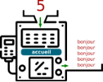
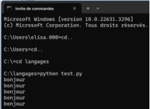
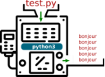
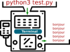
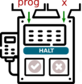
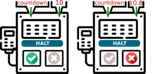
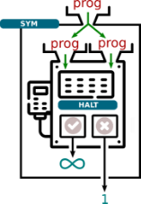
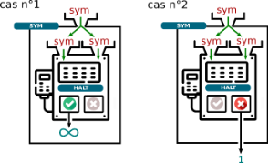
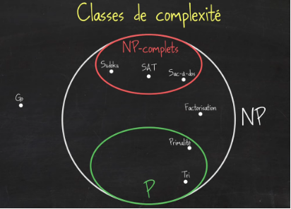

---
author: ELP
title: 14 Calculabilité - Décidabilité
---


**Table des matières**

[1.	Un programme comme paramètre d’un programme	](#_toc162880854)

[2.	Mon programma va-t-il s’arrêter ?	](#_toc162880855)

[3.	Calculabilité	](#_toc162880861)

[3.	exercices	](#_toc162880862)

**Compétences évaluables :**

- comprendre que tout programme est aussi une donnée
- comprendre que la calculabilité ne dépend pas du langage de programmation utilisé
- montrer, sans formalisme théorique, que le problème de l'arrêt est indécidable

## <a name="_toc162880854"></a>**1. Un programme comme paramètre d’un programme**

Les codes que nous manipulons ressemblent souvent à cela :

```python
def accueil(n):
    for k in range(n):
        print("bonjour")
```

Le programme s'appelle accueil, et pour fonctionner il a besoin d'un paramètre, qui sera ici un nombre entier n.

Voici comment nous pouvons représenter notre machine accueil, son paramètre d'entrée (5) et sa sortie (les 5 «bonjour»)



Maintenant, enregistrons le code suivant dans un fichier test.py  dans un fichier facile à atteindre (par exemple langages)

```python
def accueil(n):
    for k in range(n):
        print("bonjour")

accueil(5)
```

Pour exécuter ce code, nous devons taper dans un terminal l'instruction suivante :



L'illustration correspondante sera donc :



Mais nous pouvons aller encore plus loin : l'instruction python test.py est tapée dans un terminal, qui lui-même est un programme appelé Terminal.

Et donc :



Conclusion :

**Il n'y a donc aucun obstacle à considérer un programme comme une simple donnée, pouvant être reçue en paramètre par un autre programme.** (voire par lui-même !)

À titre anecdotique, on pourra exécuter avec intérêt cette instruction Python : `a='a=%r;print(a%%a)';print(a%a)` Ce type de code (magique !) existe dans tous les langages et s'appelle un [quine](https://fr.wikipedia.org/wiki/Quine_\(informatique\)) : lorsqu’on exécute ce code, il imprime son propre code source

## <a name="_toc162880855"></a>**2. Mon programma va-t-il s’arrêter ?**
### <a name="_toc162880856"></a>**2.1. Exemple**

Considérons le programme suivant :

```python 
def countdown(n):
    while n != 0:
        print(n)
        n = n - 1
    print("fini")
```

En l'observant attentivement, je peux prévoir que countdown(10) affichera les nombres de 10 à 1 avant d'écrire "fini". Puis le programme s'arrêtera.

Mais que va provoquer countdown(10.8) ?

Comme la variable n ne sera jamais égale à 0, le programme va rentrer dans une boucle infinie, il ne s'arrêtera jamais. Mauvaise nouvelle. J'ai pu prévoir ceci en regardant attentivement le code de mon programme. J'ai «remarqué» qu'une variable n non entière provoquerait **une boucle infinie**.

**Question :** Est-ce qu'un programme d'*analyse de programmes* aurait pu faire cela à ma place ?

## <a name="_toc162880857"></a>**2.2. Une machine pour prédire l’arrêt ou non d’un programme**

Après tout, un programme est une suite d'instructions (le code-source), et peut donc être, comme on l'a vu, le paramètre d'entrée d'un autre programme qui l'analyserait. Un tel programme (appelons-le halt) prendrait **en entrées** :

- un **paramètre prog** (le code-source du programme)
- un **paramètre x**, qui serait le paramètre d'entrée de prog.

L'instruction halt(prog, x) renverrait True si prog(x) s'arrête, et False si prog(x) ne s'arrête pas.



**Exemple** :

- halt(countdown, 10) renverrait True.
- halt(countdown, 10.8) renverrait False.



**Tentative d'écriture de halt en Python :**

```python
def halt(prog, x):
    if "prog(x) s'arrête": # mes excuses, je n'ai pas eu le temps de finir totalemt ce code
        return True
    else :
        return False
```

Nous en resterons là pour l'instant dans l'écriture de ce programme. Nous allons nous en servir pour construire d'autres programmes.

### <a name="_toc162880858"></a>**2.3. Amusons-nous avec ce programme halt.**

Considérons le programme :

```python
def sym(prog):
    if halt(prog, prog) == True:
        while True:
            print("vers l'infini et au-delà !")
    else:
        return 1
```

On peut remarquer que le programme halt est appelé avec comme paramètres prog, prog, ce qui signifie que **prog se prend lui-même en paramètre**. On rappelle que ce n'est pas choquant, un code-source étant une donnée comme une autre.



Ce programme sym reçoit donc en paramètre un programme prog, et :

- va rentrer dans une boucle infinie si prog(prog) s'arrête.
- va renvoyer 1 si prog(prog) ne s'arrête pas.

### <a name="_toc162880859"></a>**2.4. Un léger problème ...**

Puisqu'un programme peut prendre en paramètre son propre code-source, que donnerait l'appel à sym(sym) ?

Deux cas peuvent se présenter, suivant si halt(sym, sym) renvoie True ou False.



- **cas n°1** : halt(sym, sym) renvoie True, ce qui signifie que sym(sym) devrait s'arrêter. Mais dans ce cas-là, l'exécution de sym(sym) rentre dans une boucle infinie. **C'est une contradiction**.
- **cas n°2** : halt(sym, sym) renvoie False, ce qui signifie que sym(sym) rentre dans une boucle infinie. Mais dans ce cas-là, l'exécution de sym(sym) se termine correctement et renvoie la valeur 1. **C'est une contradiction.**

### <a name="_toc162880860"></a>**2.5. Conclusion**

Nous venons de prouver que notre programme halt, censé prédire si un programme prog peut s'arrêter sur une entrée x, **NE PEUT PAS EXISTER**.

Ce résultat théorique, d'une importance cruciale, s'appelle **le problème de l'arrêt**.

**Problème de l'arrêt   ❤️❤️❤️**

Il **ne peut pas exister** de programme universel qui prendrait en entrées :

- un programme P
- une entrée E de ce programme P

et qui déterminerait si ce programme P, lancé avec l'entrée E, va s'arrêter ou non.

Ce résultat a été démontré par [Alan Turing](https://fr.wikipedia.org/wiki/Alan_Turing) en 1936, dans un article intitulé *«On computable numbers, with an application to the Entscheidungsproblem»*.

Pour sa démonstration, il présente un modèle théorique de machine capable d'exécuter des instructions basiques sur un ruban infini, les [machines de Turing](https://fr.wikipedia.org/wiki/Machine_de_Turing).

À la même époque, le mathématicien [Alonzo Church](https://fr.wikipedia.org/wiki/Alonzo_Church) démontre lui aussi ce théorème de l'arrêt, mais par un moyen totalement différent, en inventant le [lambda-calcul](https://fr.wikipedia.org/wiki/Lambda-calcul).

Tous deux mettent ainsi un terme au rêve du mathématicien allemand [David Hilbert](https://fr.wikipedia.org/wiki/David_Hilbert), qui avait en 1928 posé la question de l'existence d'un algorithme capable de répondre «oui» ou «non» à n'importe quel énoncé mathématique posé sous forme décisionnelle («un triangle rectangle peut-il être isocèle ?», «existe-t-il un nombre premier pair ?»)

Cette question, appelée «problème de la décision», ou *Entscheidungsproblem* en allemand, est définitivement tranchée par le problème de l'arrêt : un tel théorème ne peut pas exister, puisque par exemple, aucun algorithme ne peut répondre «oui» ou «non» à la question «ce programme va-t-il s'arrêter ?».

Le théorème de l'arrêt sera étendu plus tard par [le théorème de Rice](https://fr.wikipedia.org/wiki/Th%C3%A9or%C3%A8me_de_Rice).

Ce résultat démontre que toutes les questions sémantiques (non évidentes) au sujet d'un programme sont indécidables :

- «ce programme va-t-il s'arrêter ?» (le théorème de l'arrêt)
- «ce programme va renvoyer la valeur 12 ?»
- «ce programme va-t-il un jour renvoyer un message d'erreur ?»
- ...

[Rice](https://en.wikipedia.org/wiki/Henry_Gordon_Rice) démontre que toutes ces questions peuvent être ramenées (on dit *réduites*) au théorème de l'arrêt, qui est indécidable.

## <a name="_toc162880861"></a>**3. Calculabilité**
### <a name="_toc162880862"></a>**3.1. Problème de l’arrêt**

Le problème de l'arrêt est dit **indécidable** car la fonction qui le résout (notre programme halt) n'est pas **calculable**.

Démonstration par l’absurde que le programme ARRET n’existe pas. 

Vidéo en anglais : <https://youtu.be/92WHN-pAFCs>

**Théorème de Turing (1936)** : il n’existe pas d’algorithme permettant de prouver la terminaison de n’importe quel programme, c’est-à-dire que le problème de l’arrêt est indécidable

**Corollaire** : Il existe des fonctions non calculables

La machine de Turing n’a pas de finalité pratique (même si elle a été réalisé de bien des manières ...). C’est une machine théorique qui a servi 0 trouver les limites de ce qui est calculable. Il arrive 0 prouver que le **problème de l’arrêt est indécidable** avec son modèle.

L’autre tour de force de Turing est d’avoir montré que ses machines sont capables de réaliser des algorithmes

complexes. Il a imaginé une machine de Turing spéciale qui prends en paramètre une autre machine de Turing M et une entrée e et qui simule le fonction de la machine M avec l’entrée e. C’est ce que l’on nomme la **machine de Turing universelle**.


### <a name="_toc162880863"></a>**3.2. (HP) Calculable, oui, mais facilement ? -> 1 million de $ à gagner ci-dessous.**

Les machines de Turing constituent un outil important dans le domaine de classe de complexité des algorithmes et en particulier de la détermination des classes de problème que l’on peut résoudre dans un temps raisonnable, c’est à dire qui augmentent de façon polynomiale en fonction de la taille des entrées. 

-\ On appelle **cette classe P**. : On dira que sont de **«classe P»** tous les problèmes dont l'algorithme de recherche de solution est de **complexité polynomiale**.

  Que retrouve-t-on dans la classe P ? Tous les problèmes dont la solution est un algorithme de complexité linéraire, quadratique, logarithmique... Tout mais surtout pas un algorithme de complexité exponentielle.

-\ Une autre classe de problème est celle des problèmes de décision dont la vérification du résultat, une fois celui-ci connu, demande un temps polynomial. On la note **NP**. 

  On dira que sont de **«classe NP»** tous les problèmes dont l'algorithme de recherche de solution est **Non-déterministe Polynomial**.

  Que veut dire la formulation «non-déterministe polynomial» ? Cela fait référence à ce que serait capable de faire une machine de Turing (donc, n'importe quel ordinateur) travaillant de manière **non-déterministe**, donc capable d'explorer simultanément plusieurs solutions possibles. On peut imaginer un arbre dont le parcours se ferait simultanément dans toutes les branches, et non en largeur ou profondeur comme nous l'avons vu.

  On dira que sont de **«classe NP»** tous les problèmes dont l'algorithme de **vérification** de solution est **polynomial**.

  Pour le résumer très grossièrement, un problème de classe NP est un problème dont on sait vérifier facilement si une solution proposée marche ou pas :

    - la résolution d'un sudoku est dans NP : si quelqu'un vous montre un sudoku rempli, vous pouvez très rapidement lui dire si sa solution est valable ou pas.
    - la factorisation d'un nombre est dans NP : si quelqu'un vous propose 4567\*6037 comme décomposition de 27570979, vous pouvez très rapidement lui dire s'il a raison. (oui.)
    - le problème du sac à dos (en version décisionnelle) est dans NP. Une proposition de butin peut facilement être examinée pour savoir si elle est possible ou non.
    - le problème du voyageur de commerce (ou TSP : Traveller Sales Problem), en version décisionnelle, est dans NP. Si on vous propose un trajet, vous pouvez facilement vérifier que sa longueur est (par exemple) inférieure à 150 km.

-\ Un problème important l’informatique actuelle est de savoir si P = NP. Très schématiquement, il s’agit de déterminer si le fait de pouvoir vérifier rapidement une solution à un problème implique de pouvoir la trouver rapidement ; ou encore, si ce que nous pouvons trouver rapidement lorsque nous avons de la chance peut être trouvé aussi vite par un calcul intelligent. 

  Tous les problèmes de P ont une solution qui peut être trouvée de manière polynomiale. Donc évidemment, la vérification de cette solution est aussi polynomiale. Donc tous les problèmes de P sont dans NP. On dit que P est inclus dans NP, que l'on écrit P ⊂ NP.

  Voici une capture d'écran de l'excellente vidéo Nos algorithmes pourraient-ils être BEAUCOUP plus rapides ? (P=NP ?) de l'excellent David Louapre :

  

  On y retrouve (en vert) la classe P, qui contient les algorithmes de tri. En blanc, la classe NP, qui contient les problèmes de factorisation, du sudoku, du sac-à-dos...

  Si quelqu'un trouve un jour un algorithme de polynomial de factorisation, alors le problème de factorisation viendra se ranger dans P. (accessoirement, le RSA sera sans doute détruit par cette découverte)

  Mais certains de ces problèmes dans NP ont une propriété remarquable : la résolution polynomiale d'un seul d'entre eux ferait ramener la **totalité** des problèmes NP dans P. On dit que ces problèmes sont **NP-complets** (marqués en rouge ci-dessus) Concrètement, si vous trouvez une solution polynomiale de résolution du sudoku, vous entrainez avec lui dans P tous les autres problèmes NP, et vous aurez ainsi prouvé que P = NP. Accessoirement, vous gagnerez aussi le prix d'[un million de dollars](https://fr.wikipedia.org/wiki/Probl%C3%A8mes_du_prix_du_mill%C3%A9naire) promis par la fondation Clay à qui tranchera cette question... (prix que vous partagerez bien évidemment avec votre professeur de NSI)

  Actuellement, à part le grand [Donald Knuth](https://fr.wikipedia.org/wiki/Donald_Knuth), la plupart des chercheurs qui travaillent à ce problème sont plutôt pessimistes, et pensent que P ≠ NP. Cela signifie qu'ils pensent que certains problèmes ne pourront jamais avoir une solution polynomiale.

  Alors, P = NP ou P ≠ NP ? Réponse peut-être un jour...


=> **CAPYTALE Le code vous sera donné par votre enseignant**


**Activité n° 1 : Problème P = NP** **:** 
Répondez au questionnaire suivant à partir de la vidéo de ScienceEtonnante : [https://ladigitale.dev/digiview/#/v/66c9f21514c6a](https://ladigitale.dev/digiview/#/v/66c9f21514c6a) 

1. Quelle est la complexité de la recherche du minimum dans une liste ? 
2. Quelle est la complexité du premier tri présenté dans la vidéo ?
3. Quelle est la complexité de l’algorithme de tri le plus rapide présenté dans la vidéo ? Pouvez-vous donner le nom d’un algorithme vu en classe qui réalise ce tri ? 
4. Citez un problème de complexité exponentielle. Expliquez en quoi il consiste
5. Quelle inclusion est correcte (de manière triviale) P ⊂ NP ou NP ⊂ P? Expliquez
6. Citez un problème dont on pensait qu’il était NP et qui est devenu P
7. Donner le nom d’un problème “universel” ou NP-complet à résoudre pour résoudre tout les problèmes NP en temps polynomial
8. Quel plan peut-on suivre pour résoudre P=NP et empocher le million ?

## <a name="_toc162880862"></a>**4. Exercices**

**Exercice 1 : Le programme qui lit un programme**
On vous fournit le code suivant écrit en Python :
   ```python
   def analyse_programme(programme):
       lignes = programme.split('\n')
       return len(lignes)
   
   programme_exemple = """
   def somme(a, b):
       return a + b
   
   resultat = somme(5, 3)
   print(resultat)
   """
   
   print(analyse_programme(programme_exemple))
   ```
**Question 1** : Expliquez comment ce programme traite le code source qui lui est fourni.

**Question 2** : Modifiez le programme pour qu'il compte le nombre total de caractères (y compris les espaces et les retours à la ligne) dans le code source fourni.


**Exercice 2 : Calculer la somme des premiers entiers dans différents langages**
On vous propose trois implémentations d'une fonction qui calcule la somme des premiers entiers naturels dans trois langages différents : Python, JavaScript et C++. Comparez ces programmes.
   
   - **Python** :
   ```python
   def somme_entiers(n):
       return sum(range(n+1))
   ```
   
   - **JavaScript** :
   ```javascript
   function sommeEntiers(n) {
       let sum = 0;
       for (let i = 0; i <= n; i++) {
           sum += i;
       }
       return sum;
   }
   ```
   
   - **C++** :
   ```cpp
   int sommeEntiers(int n) {
       int sum = 0;
       for (int i = 0; i <= n; i++) {
           sum += i;
       }
       return sum;
   }
   ```

**Question 1** : Expliquez en quoi ces trois programmes réalisent le même calcul malgré les différences de syntaxe.

**Question 2** : Discutez de l'importance du langage de programmation dans la réalisation d'une tâche donnée. Est-ce que le choix du langage influence la capacité à résoudre ce problème ?


**Exercice 3 : Explication du problème de l'arrêt par l'exemple**
On définit un programme `arrêt_test` en Python qui prend en entrée un programme sous forme de chaîne de caractères, ainsi qu'une entrée pour ce programme, et qui doit déterminer si le programme s'arrête ou non.
   
   ```python
   def arret_test(programme, entree):
       # Ce programme suppose qu'il peut déterminer si un programme s'arrête ou non.
       # Imaginons que nous avons une telle fonction magique.
       if execute_programme(programme, entree):
           return "Le programme s'arrête."
       else:
           return "Le programme ne s'arrête pas."
   ```
   
**Question 1** : Expliquez pourquoi il est impossible de créer une fonction `execute_programme` qui détermine toujours correctement si un programme donné va s'arrêter ou non.

**Question 2** : Proposez un scénario où `arret_test` échouerait à donner la bonne réponse si une telle fonction `execute_programme` existait.


