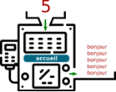
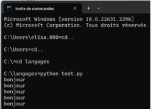
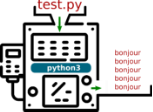
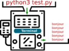
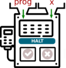
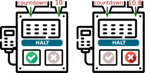
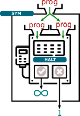
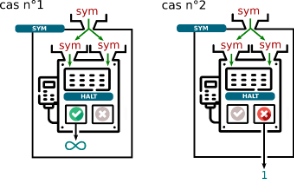
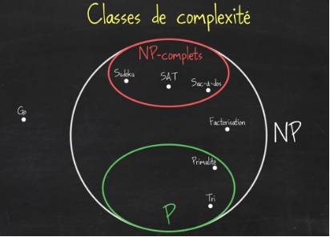

---
author: ELP
title: 14 Calculabilité – Décidabilité
---


**📚 Table des matières**

[1.	Un programme comme paramètre d’un programme	](#_toc162880854)

[2.	Mon programma va-t-il s’arrêter ?	](#_toc162880855)

[3.	Calculabilité	](#_toc162880861)

[3.	exercices	](#_toc162880862)

**🎯 Compétences évaluables :**

- comprendre que tout programme est aussi une donnée
- comprendre que la calculabilité ne dépend pas du langage de programmation utilisé
- montrer, sans formalisme théorique, que le problème de l'arrêt est indécidable


## <H2 STYLE="COLOR:BLUE;"> <a name="_toc162880854"></a>🧩 **1. Un programme comme paramètre d’un programme**</H2>


Les codes que nous manipulons ressemblent souvent à ceci :

```python
def accueil(n):
    for k in range(n):
        print("bonjour")
```

🧠 Le programme s’appelle **`accueil`**.
Pour fonctionner, il a besoin d’un **paramètre d’entrée**, ici un **entier `n`**.

---

#### 🔁 Programme = machine + entrée + sortie

On peut représenter :

* 🧠 la **machine** (le programme `accueil`)

* 📥 son **paramètre d’entrée** (par exemple `5`)

* 📤 sa **sortie** (l’affichage de 5 fois le mot *bonjour*)

{: .center}

---

#### ▶️ Exécution du programme depuis un fichier

Enregistrons maintenant ce code dans un fichier `test.py`
(par exemple dans un dossier nommé *langages*) :

```python
def accueil(n):
    for k in range(n):
        print("bonjour")

accueil(5)
```

Pour exécuter ce programme, on tape dans un **terminal** :

{: .center}

L’illustration correspondante est donc :

{: .center}

---

#### 🧠 Mise en abyme : un programme lance un programme

Mais nous pouvons aller encore plus loin.

👉 L’instruction `python test.py` est tapée dans un **terminal**, or le **terminal est lui-même un programme**.

On obtient donc la situation suivante :

{: .center}

---

#### ✅ Conclusion essentielle

> **Il n’y a donc aucun obstacle à considérer un programme comme une simple donnée**,
> pouvant être reçue en paramètre par un autre programme
> *(voire par lui-même !)*

C’est une idée **fondamentale** pour la suite du chapitre.

---

#### 💡 Culture informatique (anecdotique mais éclairante)

On peut exécuter avec intérêt l’instruction Python suivante :

```python
a='a=%r;print(a%%a)';print(a%a)
```

Ce type de programme existe dans tous les langages et s’appelle un [**quine**](https://fr.wikipedia.org/wiki/Quine_%28informatique%29).

👉 Lorsqu’on exécute ce code, il **affiche son propre code source**.

Cela illustre parfaitement le fait qu’un **programme peut manipuler des programmes**, y compris **lui-même**.

---


## <H2 STYLE="COLOR:BLUE;"> <a name="_toc162880855"></a>🕒 **2. Mon programme va-t-il s’arrêter ?**</H2>


---

### <H3 STYLE="COLOR:GREEN;"> <a name="_toc162880856"></a>🔍 **2.1. Exemple**</H3>

Considérons le programme suivant :

```python
def countdown(n):
    while n != 0:
        print(n)
        n = n - 1
    print("fini")
```

🧠 En observant attentivement ce code, on peut prévoir que :

* `countdown(10)` affiche les nombres de **10 à 1**,

* puis affiche **"fini"**,

* et **le programme s’arrête**.

---

❓ Mais que va provoquer l’appel suivant ?

```python
countdown(10.8)
```

👉 Dans ce cas :

* la variable `n` n’est **jamais égale à 0**,

* la condition `while n != 0` reste toujours vraie,

* le programme entre dans une **boucle infinie**,

* il **ne s’arrête jamais**.

⚠️ Mauvaise nouvelle.

Ici, nous avons pu **prévoir le comportement du programme** simplement en lisant le code : nous avons remarqué qu’une valeur **non entière** de `n` provoquait une **boucle infinie**.

---

❓ **Question centrale**

> Est-ce qu’un programme d’*analyse de programmes*
> aurait pu faire ce raisonnement **à ma place** ?

---

### <H3 STYLE="COLOR:GREEN;"> <a name="_toc162880857"></a>🤖 **2.2. Une machine pour prédire l’arrêt d’un programme**</H3>

Un programme est une **suite d’instructions**, c’est-à-dire une **donnée**.
Il peut donc être donné **en entrée** d’un autre programme.

Imaginons alors un programme que l’on appellera **`halt`**, capable de déterminer si un programme s’arrête ou non.

🧩 Ce programme `halt` prendrait en **entrées** :

* 📄 **`prog`** : le code-source du programme à analyser

* 📥 **`x`** : une entrée pour ce programme

Et il renverrait :

* `True` si `prog(x)` **s’arrête**

* `False` si `prog(x)` **ne s’arrête pas**

{: .center}

📌 **Exemples** :

* `halt(countdown, 10)` → `True`

* `halt(countdown, 10.8)` → `False`

{: .center}

---

🧪 **Tentative d’écriture de `halt` en Python** :

```python
def halt(prog, x):
    if "prog(x) s'arrête":  # (impossible à implémenter réellement)
        return True
    else:
        return False
```

⚠️ Bien entendu, ce code n’est **pas réalisable** : la condition `"prog(x) s'arrête"` n’est pas testable automatiquement.

👉 Nous allons néanmoins **supposer que `halt` existe**, afin de raisonner par l’absurde.

> *Cette hypothèse volontairement irréaliste sert uniquement à raisonner par l’absurde.*


---

### <H3 STYLE="COLOR:GREEN;"> <a name="_toc162880858"></a>🎲 **2.3. Amusons-nous avec ce programme `halt`**</H3>

Considérons maintenant le programme suivant :

```python
def sym(prog):
    if halt(prog, prog) == True:
        while True:
            print("vers l'infini et au-delà !")
    else:
        return 1
```

🧠 Ici :

* `halt` est appelé avec les paramètres `prog, prog`

* le programme `prog` est donc **passé comme entrée à lui-même**

👉 Ce n’est pas choquant : un **programme est une donnée**, comme une autre.

{: .center}

📌 Le comportement de `sym` est alors le suivant :

* si `prog(prog)` **s’arrête** → `sym` entre dans une **boucle infinie**

* si `prog(prog)` **ne s’arrête pas** → `sym` renvoie `1`

---

### <H3 STYLE="COLOR:GREEN;"> <a name="_toc162880859"></a>⚠️ **2.4. Un léger problème…**</H3>

Puisqu’un programme peut prendre **son propre code-source** en paramètre, que se passe-t-il si l’on appelle :

```python
sym(sym)
```

Deux cas sont possibles, selon la valeur de `halt(sym, sym)` :

{: .center}

---

❌ **Cas n°1** : `halt(sym, sym)` renvoie `True`

* cela signifie que `sym(sym)` **s’arrête**

* mais dans ce cas, `sym(sym)` entre dans une **boucle infinie**

➡️ **Contradiction**

---

❌ **Cas n°2** : `halt(sym, sym)` renvoie `False`

* cela signifie que `sym(sym)` **ne s’arrête pas**

* mais dans ce cas, `sym(sym)` renvoie `1` et **s’arrête**

➡️ **Contradiction**

---

### <H3 STYLE="COLOR:GREEN;"> <a name="_toc162880860"></a>🏁 **2.5. Conclusion**</H3>

Nous venons de démontrer que le programme `halt`, censé prédire si un programme s’arrête ou non, **ne peut pas exister**.

Ce résultat fondamental s’appelle :

## ❤️❤️❤️ **Le problème de l’arrêt**

> Il **n’existe pas** de programme universel capable de déterminer,
> pour n’importe quel programme `P` et n’importe quelle entrée `E`,
> si `P(E)` va s’arrêter ou non.

---

📚 Ce résultat a été démontré en **1936** par **Alan Turing**, dans l’article *On computable numbers, with an application to the Entscheidungsproblem*.

Pour cela, il introduit un modèle théorique fondamental : les **machines de Turing**.

À la même époque, **Alonzo Church** démontre le même résultat en développant le **lambda-calcul**.

---

🎯 Ces travaux mettent fin au projet de **David Hilbert**, qui cherchait un algorithme capable de répondre par **oui ou non** à toute question mathématique posée sous forme décisionnelle.

---

📌 Le théorème de l’arrêt sera ensuite généralisé par le **Henry Gordon Rice**.

Il montre que **toutes les questions sémantiques non triviales** sur un programme sont **indécidables**, par exemple :

* « ce programme va-t-il s’arrêter ? »

* « ce programme va-t-il renvoyer 12 ? »

* « ce programme provoquera-t-il une erreur ? »

---

### <H3 STYLE="COLOR:GREEN;"> <a name="_toc162880862"></a>🚫 **2.6. Mise en pratique — Peut-on décider de l’arrêt d’un programme ? (TD)**</H3>

!!! info "🧠 **Capytale : le code ou les documents seront fournis par votre enseignant : TNSI_14_problème de l'arrêt**"


## <H2 STYLE="COLOR:BLUE;"> <a name="_toc162880861"></a>🧮 **3. Calculabilité**</H2>


---

### <H3 STYLE="COLOR:GREEN;"> <a name="_toc162880862"></a>🚫 **3.1. Problème de l’arrêt**</H3>

Le **problème de l’arrêt** est dit **indécidable**, car la fonction censée le résoudre (notre programme hypothétique `halt`) **n’est pas calculable**.

👉 Autrement dit, il **n’existe pas d’algorithme** capable de décider, dans tous les cas, si un programme va s’arrêter ou non.

---

🧠 **Rappel du raisonnement**

Nous avons montré, par **raisonnement par l’absurde**, que le programme `halt` ne peut pas exister sans contradiction.

---

🎥 **Pour aller plus loin (vidéo en anglais)**
👉 [https://youtu.be/92WHN-pAFCs](https://youtu.be/92WHN-pAFCs)

---

📜 **Théorème de Turing (1936)**

> Il n’existe **aucun algorithme** permettant de prouver la terminaison de **n’importe quel programme**.
>
> 👉 Le problème de l’arrêt est **indécidable**.

Ce théorème est dû à **Alan Turing**.

---

📌 **Corollaire important**

➡️ Il existe des **fonctions non calculables**, c’est-à-dire des problèmes pour lesquels **aucun algorithme** ne peut être écrit.

---

🧩 **Rôle de la machine de Turing**

La **machine de Turing** n’a pas de finalité pratique directe (bien qu’elle ait été réalisée sous de nombreuses formes).

C’est une **machine théorique**, conçue pour :

* définir précisément ce qu’est un **algorithme**,

* déterminer les **limites de ce qui est calculable**.

👉 Elle permet notamment de prouver que le **problème de l’arrêt est indécidable**.

---

🔁 **Machine de Turing universelle**

L’un des apports majeurs de Turing est d’avoir montré qu’une machine de Turing peut **simuler une autre machine de Turing**.

Il imagine une machine spéciale qui prend en paramètres :

* une machine de Turing `M`,

* une entrée `e`,

et qui **simule l’exécution de `M` sur `e`**.

➡️ C’est le principe de la **machine de Turing universelle**, ancêtre théorique de l’ordinateur moderne.

---

### <H3 STYLE="COLOR:GREEN;"> <a name="_toc162880863"></a>💰 **3.2. (HP) Calculable, oui… mais facilement ?**</H3>

Les machines de Turing sont également un outil fondamental pour étudier la **complexité des algorithmes**.

👉 L’objectif n’est plus seulement de savoir **si un problème est calculable**, mais **s’il peut être résolu efficacement**.

---

### 🟢 **Classe P**

On appelle **classe P** l’ensemble des problèmes :

* dont la solution peut être **trouvée**,

* par un algorithme de **complexité polynomiale**
  (linéaire, quadratique, logarithmique…).

📌 En revanche :

* les algorithmes de **complexité exponentielle** n’appartiennent pas à P.

---

### 🔵 **Classe NP**

La classe **NP** regroupe les problèmes de décision pour lesquels :

* une solution peut être **vérifiée** en temps polynomial,

* même si elle n’est pas facile à **trouver**.

NP signifie **Non-déterministe Polynomial**.

---

🧠 **Intuition du non-déterminisme**

Cela correspond à une machine capable :

* d’explorer **plusieurs solutions en parallèle**,

* comme si elle parcourait **toutes les branches d’un arbre en même temps**.

---

📌 **Exemples de problèmes dans NP**

* 🧩 **Sudoku** :
  une solution proposée se vérifie très rapidement.

* 🔢 **Factorisation d’un nombre** :
  vérifier une décomposition est facile.

* 🎒 **Problème du sac à dos** (version décisionnelle).

* 🗺️ **Problème du voyageur de commerce (TSP)**
  en version décisionnelle.

---

### ❓ **Le grand problème : P = NP ?**

La question centrale est la suivante :

> Si l’on peut **vérifier rapidement** une solution,
> peut-on **toujours la trouver rapidement** ?

---

📌 **Relation entre P et NP**

* Tous les problèmes de **P** sont aussi dans **NP**
  👉 on écrit : **P ⊂ NP**

Mais on ne sait toujours pas si :

* **P = NP**

  ou

* **P ≠ NP**

---

🎥 Illustration (vidéo de David Louapre – Science Étonnante) :

{: .center}

* 🟢 en vert : la classe **P** (ex. algorithmes de tri),

* ⚪ en blanc : la classe **NP**,

* 🔴 en rouge : les problèmes **NP-complets**.

---

### 🔴 **Problèmes NP-complets**

Certains problèmes de NP sont dits **NP-complets** :

👉 Trouver une solution polynomiale **pour un seul d’entre eux** entraînerait **tous les problèmes NP** dans la classe P.

📌 Exemple emblématique :

* Sudoku,

* voyageur de commerce,

* sac à dos.

---

💸 **Un million de dollars à la clé**

La fondation Clay promet **1 million de dollars** à toute personne prouvant que **P = NP** ou **P ≠ NP** (les fameux *problèmes du prix du millénaire*).

---

🧠 **État actuel des recherches**

À l’exception notable de **Donald Knuth**, la majorité des chercheurs pensent que :

> **P ≠ NP**

Cela signifierait que certains problèmes :

* sont vérifiables facilement,

* mais **impossibles à résoudre efficacement**.

---


!!! info "🧠 **Capytale : le code ou les documents seront fournis par votre enseignant**"


???+ question "🧠 **Activité n°1 — Le problème P = NP**"
    👉 Répondre aux questions suivantes **à partir de la vidéo de Science Étonnante** :
    🔗 [https://ladigitale.dev/digiview/#/v/66c9f21514c6a](https://ladigitale.dev/digiview/#/v/66c9f21514c6a)


    1. Quelle est la **complexité** de la recherche du minimum dans une liste ?  
    2. Quelle est la **complexité** du premier algorithme de tri présenté dans la vidéo ?  
    3. Quelle est la **complexité** de l’algorithme de tri le plus rapide présenté dans la vidéo ?  Pouvez-vous citer un **algorithme vu en classe** qui réalise ce type de tri ?  
    4. Citez un **problème de complexité exponentielle** et expliquez en quoi il consiste.  
    5. Quelle inclusion est correcte (de manière triviale) : **P ⊂ NP** ou **NP ⊂ P** ? Justifiez.  
    6. Citez un **problème** que l’on pensait être dans NP et qui est devenu P.  
    7. Donner le nom d’un **problème universel (NP-complet)** dont la résolution en temps polynomial permettrait de résoudre **tous les problèmes NP**.  
    8. Quel **plan général** pourrait-on suivre pour résoudre **P = NP** et empocher le **million de dollars** ?


    ??? success "✅ **Correction — Activité n°1 : Problème P = NP**"


        **1. Complexité de la recherche du minimum dans une liste**

        ➤ La recherche du minimum nécessite de parcourir tous les éléments de la liste.  
        👉 Complexité : **O(n)** (linéaire)

        ---

        **2. Complexité du premier tri présenté dans la vidéo**

        ➤ Le premier tri présenté est un tri simple (comparaison élément par élément).  
        👉 Complexité : **O(n²)** (quadratique)

        ---

        **3. Complexité du tri le plus rapide présenté**

        ➤ Le tri le plus rapide présenté a une complexité **O(n log n)**.  

        👉 Exemple d’algorithme vu en classe :

        - **Tri fusion**

        - **Tri rapide** (dans ses cas favorables)

        ---

        **4. Exemple de problème de complexité exponentielle**

        ➤ Exemple : **problème du voyageur de commerce (TSP)**.  

        Il s’agit de trouver le plus court trajet passant une seule fois par chaque ville.  
        Le nombre de possibilités augmente **exponentiellement** avec le nombre de villes.

        ---

        **5. Inclusion correcte entre P et NP**

        ➤ L’inclusion correcte est : **P ⊂ NP**

        👉 Tout problème que l’on peut résoudre rapidement (P) peut aussi être vérifié rapidement (NP). L’inverse n’est pas démontré.

        ---

        **6. Problème passé de NP à P**

        ➤ Exemple : **le test de primalité**  

        Longtemps considéré comme difficile, il est désormais résolu en temps polynomial grâce à l’algorithme **AKS**.

        ---

        **7. Exemple de problème NP-complet**

        ➤ Exemples :

        - **Sudoku**,

        - **Sac à dos**,

        - **Voyageur de commerce**.

        👉 Résoudre **un seul** de ces problèmes en temps polynomial entraînerait tous les problèmes NP dans la classe P.

        ---

        **8. Plan pour résoudre P = NP**

        ➤ Trouver un algorithme de **complexité polynomiale** pour **un problème NP-complet**.

        👉 Cela permettrait :

        - de prouver **P = NP**,

        - de résoudre tous les problèmes NP efficacement,

        - et de remporter le **prix d’un million de dollars** 🎉


---


## <H2 STYLE="COLOR:BLUE;">📝 **4. Exercices — Calculabilité et décidabilité**</H2>

---

!!! abstract "🧠 **Exercice n°1 — Un programme qui lit un programme**"
    On vous fournit le code Python suivant :


    ```python
    def analyse_programme(programme):
        lignes = programme.split('\n')
        return len(lignes)

    programme_exemple = """
    def somme(a, b):
        return a + b

    resultat = somme(5, 3)
    print(resultat)
    """

    print(analyse_programme(programme_exemple))
    ```

    **1️⃣ Question 1**  
    Expliquez **comment ce programme traite le code source** qui lui est fourni.  
    Que représente ici la variable `programme` ?

    **2️⃣ Question 2**  
    Modifiez la fonction `analyse_programme` pour qu’elle compte le **nombre total de caractères** (espaces et retours à la ligne compris) du code source fourni.


---

!!! abstract "🌍 **Exercice n°2 — Même calcul, langages différents**"
    On vous propose trois implémentations d’une fonction calculant la **somme des entiers de 0 à n** dans trois langages différents.

    **Python**
    ```python
    def somme_entiers(n):
        return sum(range(n+1))
    ```

    **JavaScript**
    ```javascript
    function sommeEntiers(n) {
        let sum = 0;
        for (let i = 0; i <= n; i++) {
            sum += i;
        }
        return sum;
    }
    ```

    **C++**
    ```cpp
    int sommeEntiers(int n) {
        int sum = 0;
        for (int i = 0; i <= n; i++) {
            sum += i;
        }
        return sum;
    }
    ```

    **1️⃣ Question 1**  
    Expliquez pourquoi ces trois programmes réalisent **le même calcul**,  
    malgré leurs différences de syntaxe.

    **2️⃣ Question 2**  
    Le choix du langage influence-t-il la **possibilité de résoudre ce problème** ?  
    Justifiez votre réponse.


---


!!! abstract "🛑 **Exercice n°3 — Pourquoi le problème de l’arrêt est indécidable**"
    On définit le programme suivant :


    ```python
    def arret_test(programme, entree):
        # Fonction supposée magique
        if execute_programme(programme, entree):
            return "Le programme s'arrête."
        else:
            return "Le programme ne s'arrête pas."
    ```

    **1️⃣ Question 1**  
    Expliquez pourquoi il est **impossible** de créer une fonction `execute_programme` qui détermine **correctement dans tous les cas** si un programme s’arrête ou non.

    **2️⃣ Question 2**  
    Proposez un **scénario de contradiction** montrant que `arret_test` donnerait une réponse fausse si une telle fonction existait.
    

---


