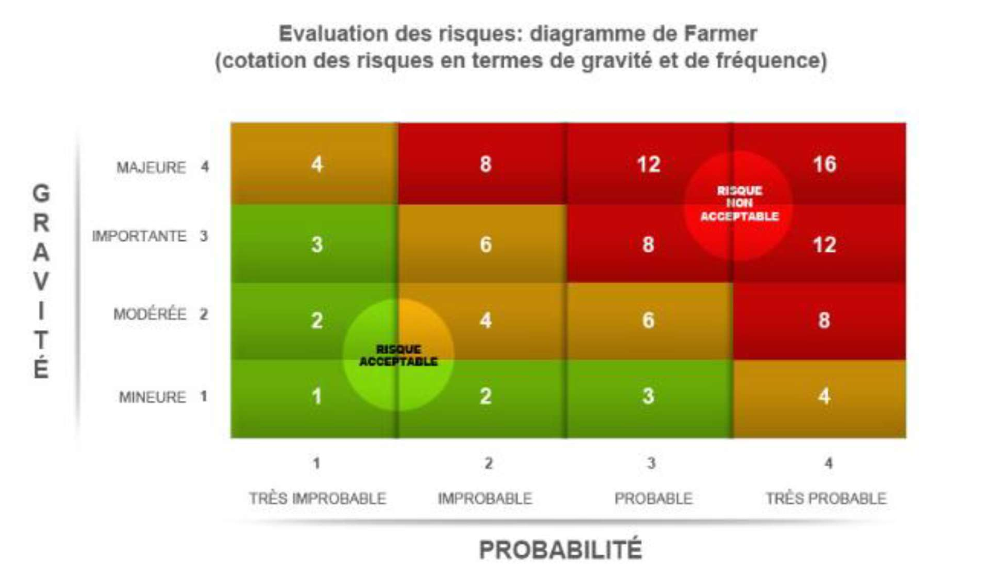
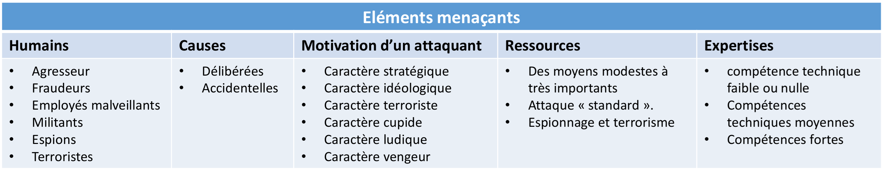
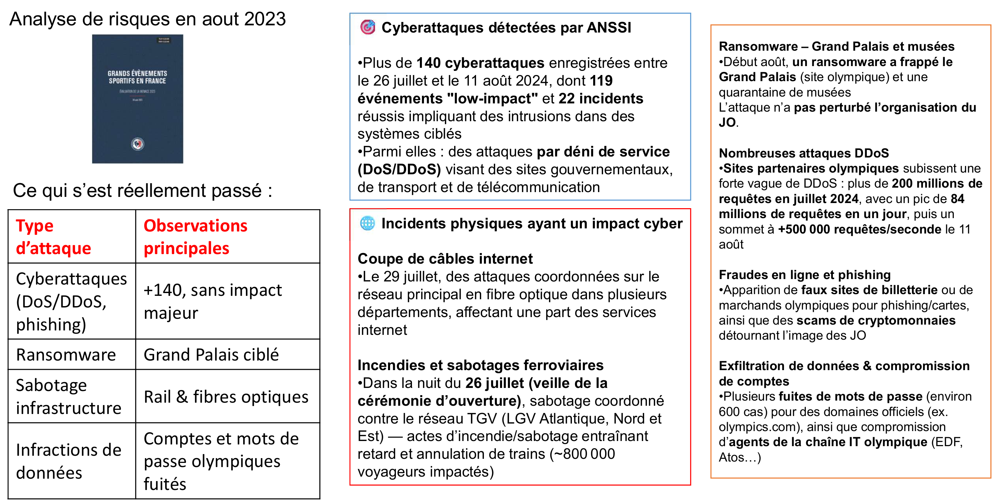

# :shield: Module Vulnérabilités et Menaces numériques

!!! abstract "Fiche module"
    **Source** : Hacoeurethique — Module 1-1  
    **Public** : Terminale NSI — Orientation métiers de la cybersécurité  
    **Référentiels** : Guide N°650 ANSSI, méthode EBIOS, ISO 27001 / ISO 15408

---

## :dart: 1. Concepts fondamentaux — Le vocabulaire du métier

### 1.1 Les définitions clés

Avant toute chose, un professionnel de la cybersécurité doit maîtriser un vocabulaire précis. Les termes suivants sont souvent confondus, y compris par des DSI expérimentés :

!!! info "Vulnérabilité"
    Faiblesse ou lacune dans un système, un processus, une application ou une organisation, qui peut être exploitée par une menace pour causer des dommages.  
    :point_right: *Exemples : logiciel obsolète, port réseau non sécurisé, faille de conception, mot de passe par défaut.*

!!! info "Menace"
    Possibilité qu'un événement redouté survienne. Elle peut être déclenchée volontairement (un hacker) ou involontairement (un employé négligent). La menace se caractérise par sa **source**, sa **motivation** et ses **moyens**.

!!! info "Scénario d'attaque"
    Description concrète et précise de la forme que peut prendre une attaque.  
    :point_right: *Exemple : « fuite de données clients via l'exploitation d'une injection SQL sur le site web de l'entreprise ».*

!!! info "Événement redouté"
    Situation que l'on cherche à éviter, comme le blocage du système d'information ou la divulgation de données personnelles.

!!! info "Risque"
    Combinaison de la **gravité** d'un impact potentiel et de la **vraisemblance** (probabilité) de sa survenue. Le risque est un effet sur l'incertitude d'un objectif à atteindre.

### 1.2 L'évaluation des risques

L'évaluation repose sur deux axes :

| Axe | Ce qu'il mesure | Niveaux |
|-----|----------------|---------|
| **Gravité** | L'impact si le risque se concrétise | Négligeable → Limité → Important → Critique |
| **Vraisemblance** | La probabilité que le risque se réalise | Minime → Significatif → Fort → Maximal |

Le croisement de ces deux dimensions sur une **matrice de risques** permet de prioriser les actions de remédiation : on traite en priorité les risques à la fois graves et vraisemblables. C'est le cœur de métier d'un **analyste en cybersécurité** et la base de la certification **ISO 27001**.

### 1.3 Les critères de sécurité : D-I-C

!!! tip "Le triangle D-I-C — à retenir absolument :triangular_ruler:"
    Tout au long du module, les impacts sont évalués selon trois critères fondamentaux :

    - :white_check_mark: **Disponibilité (D)** : le système ou l'information est accessible quand on en a besoin.
    - :white_check_mark: **Intégrité (I)** : les données n'ont pas été modifiées de manière non autorisée.
    - :white_check_mark: **Confidentialité (C)** : seules les personnes autorisées peuvent accéder à l'information.

---

## :lock: 2. Les biens à protéger

### 2.1 Les éléments essentiels (biens primordiaux)

Ce sont les éléments qui représentent le **patrimoine informationnel** de l'organisation. Ils portent les besoins de sécurité en termes de D-I-C :

- :file_folder: Informations vitales pour la mission de l'organisme
- :closed_lock_with_key: Traitements secrets ou procédés technologiques de haut niveau
- :bust_in_silhouette: Informations personnelles et nominatives (au sens CNIL / RGPD)
- :chart_with_upwards_trend: Informations stratégiques, commerciales, scientifiques
- :military_helmet: Informations classifiées ou relevant du secret défense
- :moneybag: Informations coûteuses à collecter, stocker ou transmettre

### 2.2 Les entités (biens supports)

Ce sont les composants du SI sur lesquels reposent les biens primordiaux. La méthode **EBIOS** identifie six grands types :

| Code | Type | Exemples |
|------|------|----------|
| **LOG** | Logiciels | Systèmes d'exploitation, applications, bases de données |
| **MAT** | Matériels | Serveurs, postes de travail, supports de sauvegarde, périphériques |
| **RSX** | Réseaux | Canaux informatiques et de téléphonie |
| **LOC** | Sites/Locaux | Bâtiments, salles serveurs, bureaux |
| **ORG** | Organisations | Structures, processus, supports papier, canaux interpersonnels |
| **PER** | Personnels | Utilisateurs, administrateurs, sous-traitants |

!!! warning "Retenez"
    Ce sont les **entités** qui possèdent des vulnérabilités exploitables par les attaquants. Pas les biens primordiaux eux-mêmes.

---

## :ninja: 3. Les éléments menaçants — Qui attaque et pourquoi ?

### 3.1 Typologie des profils d'attaquants

La formation distingue six grands profils, issus du Guide ANSSI N°650 :

=== ":video_game: Agresseurs (hackers/crackers)"

    Le **hacker** « passionné » est curieux, cherche le défi intellectuel, possède souvent un code d'honneur et n'a pas toujours conscience de la portée de ses actes.
    
    Le **cracker** est plus dangereux : il cherche à nuire, veut prouver sa supériorité, et peut causer d'importants dégâts par vengeance contre la société.

=== ":dollar: Fraudeurs"

    Profil proche du malfaiteur traditionnel, le fraudeur cherche à **gagner de l'argent**. Il bénéficie souvent d'une complicité interne, volontaire ou non. Ses cibles privilégiées sont les organismes qui détiennent l'argent (banques, assurances). Le crime organisé s'oriente de plus en plus vers la fraude électronique, moins risquée qu'un braquage physique.

=== ":office_worker: Employés malveillants"

    Souvent informaticiens compétents et sans antécédents judiciaires, ils pensent que leurs qualités ne sont pas reconnues ou veulent se venger de leur employeur. Ils possèdent déjà un **accès légitime** au SI et connaissent parfaitement les outils mis à leur disposition.

=== ":raised_fist: Militants (hacktivistes)"

    Motivés par une idéologie ou la religion, avec des compétences techniques très variables. Leurs objectifs vont de la diffusion massive de messages à des nuisances effectives sur les SI d'organisations en opposition avec leurs convictions.

=== ":detective: Espions"

    Acteurs de la **guerre économique**, travaillant pour un État ou un concurrent. Patients, motivés, discrets, ils savent garder le secret de leur réussite. Ils agissent souvent depuis l'intérieur de l'organisme, en y pénétrant ou en soudoyant un employé. Objectif : voler des informations stratégiques ou détruire des données vitales.

=== ":skull: Terroristes"

    Très motivés, ils cherchent l'action spectaculaire, influente, destructrice. Ils disposent souvent de moyens financiers importants et de complicités internationales. Cette menace est prise de plus en plus au sérieux par les États car une cyber-attaque peut gravement nuire aux **infrastructures critiques**.

### 3.2 Les causes de la menace

Dans le périmètre du module, seules les menaces de **cause délibérée** sont étudiées. Elles se caractérisent par :

- Une **motivation** donnée
- Des **ressources** disponibles
- Une **expertise** technique

### 3.3 Les motivations d'un attaquant

??? note "Caractère stratégique"
    Espionnage d'État ou industriel visant des informations de défense, diplomatiques, économiques, scientifiques. Pour une entreprise : récupération de clients, de procédés de fabrication, de résultats R&D.

??? note "Caractère idéologique"
    Combat pour des idées (liberté de l'information, activisme politique). Cette menace s'applique notamment aux fichiers contenant des informations à caractère privé. De nombreux pirates partagent l'idée que l'information doit être libre.

??? note "Caractère politique"
    Création d'événements médiatiques pour provoquer une prise de conscience collective. Proche du terrorisme.

??? note "Caractère terroriste"
    Déstabilisation de l'ordre établi par des actions violentes (destruction physique) ou insidieuses (désinformation, manipulation). Les auteurs recherchent l'effet spectaculaire et médiatique.

??? note "Caractère cupide"
    Gain financier (détournement de fonds, vol de brevets, concurrence déloyale) ou perte causée à la victime (destruction de système, atteinte à l'image). Les statistiques montrent que dans de nombreux cas, la menace est initiée **depuis l'intérieur même** de l'organisme.

??? note "Caractère ludique"
    Intrusion dans des systèmes, développement de virus, par jeu ou pour apprendre. Les auteurs sont motivés par la recherche d'une prouesse technique valorisante et ciblent des organisations à forte notoriété ou réputées inviolables.

??? note "Caractère vengeur"
    Employé brimé, licencié ou sur le point de l'être. Les actes sont souvent destructeurs et **décalés dans le temps** par rapport à leur cause.

### 3.4 Les ressources de l'attaquant

=== "Attaque standard"

    Un ou plusieurs ordinateurs, une connexion Internet, de la documentation technique en source ouverte. Les logiciels nécessaires sont disponibles sur des serveurs publics. L'utilisation de machines relais (rebonds) assure l'anonymat.

=== "Espionnage et terrorisme"

    Moyens financiers et techniques très importants (parfois étatiques). Centaines d'ingénieurs pour développer certains codes malveillants. Techniques HUMINT (renseignement humain) combinées aux techniques cyber.

!!! danger "Point clé :warning:"
    La sophistication des attaques Internet **augmente**, mais la compétence technique des attaquants **diminue** grâce aux outils automatisés disponibles en ligne.

### 3.5 Les niveaux d'expertise

Selon Neumann et Parker, trois niveaux de compétence :

| Niveau | Exemples d'actions |
|--------|-------------------|
| :green_circle: **Faible ou nulle** | Dénaturer une information, observer, fouiller physiquement, voler, abîmer un équipement, entrer des données fausses, se mettre de connivence |
| :orange_circle: **Moyenne** | Balayer un SI, fouiller logiquement, écouter, faire fuir de l'information, se faire passer pour quelqu'un d'autre, rejouer une transaction, abuser de ses droits |
| :red_circle: **Forte** | Modifier le système, exploiter un cheval de Troie, fabriquer une bombe logique, un ver ou un virus, réaliser une attaque asynchrone, décrypter |

### 3.6 Sources de menaces (classification EBIOS)

??? abstract "Sources humaines internes délibérées"
    - **Faibles capacités** : collaborateur malveillant avec possibilités limitées, stagiaire, client, personnel d'entretien
    - **Capacités importantes** : manager en fin de contrat, développeur, fraudeur, sous-traitant, personnel de maintenance
    - **Capacités illimitées** : administrateur système/réseau, dirigeant

??? abstract "Sources humaines externes délibérées"
    - **Faibles capacités** : script-kiddies, vandales
    - **Capacités importantes** : militants, pirates passionnés, anciens employés, concurrents, journalistes, ONG
    - **Capacités illimitées** : organisations criminelles, agences gouvernementales, espions, organisations terroristes

??? abstract "Sources humaines accidentelles (internes et externes)"
    Collaborateurs maladroits ou inconscients, de capacités faibles à illimitées. L'erreur humaine reste un facteur majeur.

??? abstract "Sources non humaines"
    Code malveillant d'origine inconnue, phénomènes naturels, catastrophes (séismes, pandémies), activité animale, événements internes (incendie, fuite, réorganisation).

---

## :boom: 4. Les 15 méthodes d'attaque génériques

### 4.1 Destruction et rayonnements

| Attaque | Description |
|---------|-------------|
| **Sabotage** | Mise hors service d'un SI ou d'une de ses composantes. Atteinte à l'intégrité et surtout à la **disponibilité**. |
| **Brouillage électromagnétique** | Technique militaire rendant le SI inopérant. Attaque de haut niveau, moyens importants, facilement détectable. |

### 4.2 Écoute passive

| Attaque | Description |
|---------|-------------|
| **Écoute réseau** (sniffing) | Placement sur un réseau pour analyser et sauvegarder les informations en transit. Parades : protections physiques et chiffrement (COMSEC, INFOSEC). |
| **Interception de signaux compromettants** | Récupération et interprétation de signaux électromagnétiques (émissions satellite, radio, signaux parasites). Parades : matériels TEMPEST et saut de fréquence (TRANSEC). |
| **Cryptanalyse** | Attaque d'un chiffre nécessitant d'excellentes connaissances en mathématiques et une forte puissance de calcul. Principalement le fait de services de renseignement. |

!!! warning "Vocabulaire à maîtriser :abc:"
    | Action | Description |
    |--------|-------------|
    | **Chiffrer** | Transformer un texte en clair en texte chiffré **avec** une clé de chiffrement |
    | **Déchiffrer** | Retrouver le texte en clair **avec** la clé de déchiffrement |
    | **Décrypter** | Retrouver le texte en clair **sans** posséder la clé |
    | ~~Crypter~~ | :x: **Ce mot ne se dit pas !** Le terme correct est « chiffrer » |

### 4.3 Récupération de supports recyclés ou mis au rebut

Fouille systématique des poubelles, récupération d'éditions sur imprimantes partagées, analyse des données stockées sur des machines réattribuées ou envoyées en maintenance sans effacement préalable.

### 4.4 Divulgation

- **Chantage** : exploitation des données personnelles ou des faiblesses identifiées pour soutirer de l'argent ou menacer de sabotage.
- **Hameçonnage (phishing)** : obtention d'informations confidentielles en se faisant passer pour une entité digne de confiance. Forme d'**ingénierie sociale**.

### 4.5 Informations sans garantie d'origine

- **Canular (hoax)** : fausses alertes transmises par courrier électronique, contribuant à la désinformation.
- **Fausse nouvelle (fake news / infox)** : informations délibérément fausses émanant d'individus, médias ou gouvernements, utilisant des titres accrocheurs pour maximiser les partages en ligne. Objectif : obtenir un avantage financier ou politique.

### 4.6 Piégeage des logiciels

??? example "Bombe logique :bomb:"
    Programme dormant qui se déclenche à un événement spécifique (date, action). Effets allant de l'affichage d'un message à la destruction de données.

??? example "Virus :microbe:"
    Programme malicieux capable de se reproduire (infection), comportant des fonctions de test, propagation et déclenchement. Conséquences : perte d'intégrité, dégradation ou interruption de service.

??? example "Ver :worm:"
    Programme malicieux qui se déplace à travers un réseau pour le perturber ou le rendre indisponible. Exemples célèbres : Code Red (août 2001), Nimda (septembre 2001), MS-SQL Slammer (janvier 2003).

??? example "Piégeage"
    Introduction de fonctions cachées en phase de conception, fabrication, transport ou maintenance.

??? example "Exploitation de bug :bug:"
    Exploitation de failles dans les logiciels commerciaux. La standardisation des logiciels et le nombre croissant de failles découvertes rendent les organismes de plus en plus vulnérables.

??? example "Canal caché"
    Technique de haut niveau permettant de faire fuir des informations en violant la politique de sécurité (canaux de stockage, temporels, de raisonnement).

??? example "Cheval de Troie :horse:"
    Programme comportant une fonctionnalité cachée permettant de contourner les contrôles de sécurité. Doit être « attirant » (nom évocateur), inspirer confiance et ne pas laisser de traces. Exemple classique : simulation de terminal pour capturer les mots de passe.

??? example "Botnet :robot:"
    Réseau de robots logiciels installés sur des machines nombreuses, recevant des instructions via IRC pour envoyer du spam, voler des informations ou mener des attaques DDoS.

??? example "Logiciel espion (spyware) :eye:"
    Logiciel malveillant collectant et transmettant à des tiers des informations depuis l'environnement infecté, à l'insu de l'utilisateur.

### 4.7 Saturation du système d'information

- **Perturbation** : actions visant à désorganiser, affaiblir ou ralentir le système cible en faussant son comportement ou en le saturant.
- **Saturation (DDoS)** : remplissage d'une zone de stockage ou d'un canal de communication jusqu'à provoquer un **déni de service**.
- **Pourriel (spam)** : courrier électronique indésirable transmis en masse, contribuant à la pollution et à la saturation des boîtes mail.

### 4.8 Utilisation illicite des matériels

| Technique | Description |
|-----------|-------------|
| **Buffer Overflow** | Exploitation d'un défaut d'implémentation pour faire exécuter un code malveillant à distance. Technique complexe mais outils automatisés disponibles. |
| **Fouille informatique** | Étude méthodique des fichiers et variables d'un SI, facilitée par les protections insuffisantes (droits trop permissifs). |
| **Mystification** | Simulation du comportement d'une machine pour tromper un utilisateur légitime et capturer ses identifiants. |
| **Trappe (backdoor)** | Point d'entrée laissé par un développeur, parfois non retiré en production. *Ex : faille VSFTPD v2.3.4 avec le port 6200 ouvert via le login* `:)` |
| **Technique du salami** | Retrait de sommes imperceptibles sur de nombreux comptes pour les rassembler progressivement. |
| **Inférence** | Déduction d'informations sensibles à partir du croisement de données non sensibles. |

### 4.9 Altération des données

- **Interception active** : accès avec modification des informations transmises (destruction, modification, insertion de messages, refus de service).
- **Balayage (scanning)** : envoi d'informations variées au SI pour déterminer les services actifs, le type de système, les noms d'utilisateurs.

### 4.10 Abus de droit

Utilisation malveillante de privilèges légitimes pour effectuer des opérations non autorisées.  
:point_right: *Exemple : un opérateur de sauvegarde qui fouille les fichiers sauvegardés.*

### 4.11 Usurpation de droits

| Technique | Description |
|-----------|-------------|
| **Déguisement** | Se faire passer pour quelqu'un d'autre en s'emparant de ses éléments d'identification (mot de passe, carte à puce, données biométriques). |
| **Rejeu / Pass the Hash** | Envoi d'une séquence de connexion préalablement enregistrée. Exploitation des hash de mots de passe Windows pour accéder à d'autres systèmes sans le mot de passe réel. |
| **Substitution** | Interception d'une déconnexion pour se substituer à l'utilisateur légitime, ou usurpation d'adresse réseau. |
| **Faufilement** | Franchissement d'un contrôle d'accès en même temps qu'une personne autorisée (analogie : passer derrière quelqu'un à un portique). |

### 4.12 Reniement d'actions (Répudiation)

Fait de nier avoir participé à une communication, avoir reçu ou émis un message. Cette menace justifie les mécanismes de **non-répudiation** (signature électronique, horodatage).

---

## :jigsaw: 5. Les vulnérabilités — Classification par origine

### 5.1 Vulnérabilités de conception

Résultent d'un choix initial du concepteur. **Ne peuvent être supprimées** sans remettre en cause l'entité elle-même :

- Définition intrinsèque de l'entité *(un portable est plus vulnérable au vol qu'un fixe)*
- Choix de technologie *(protocole vulnérable, débit privilégié au détriment du contrôle d'intégrité)*
- Caractéristiques limitées *(sensibilité au rayonnement liée à un choix coût/efficacité)*

### 5.2 Vulnérabilités de réalisation

Résultent des principes de fabrication. **Peuvent être corrigées** par le réalisateur :

- **Matériels** : limitations économiques, sensibilité aux agressions, composants piégés ou de mauvaise fiabilité
- **Logiciels** : erreurs de codage dupliquées dans tous les exemplaires (buffer overflow, fonctionnalités détournables). Les tests vérifient la conformité aux spécifications mais pas l'utilisation dans d'autres conditions
- **Réseaux** : vulnérabilités d'architecture plus ou moins sensibles aux attaques sur la D-I-C

### 5.3 Vulnérabilités de mise en œuvre (conditions d'emploi)

Liées à l'environnement d'installation et d'exploitation. **Corrigeables par l'exploitant** :

- **Matériels** : utilisation en dehors des conditions prévues par le fournisseur
- **Réseaux** : mauvaise adaptation des flux acceptés par rapport aux besoins réels
- **Logiciels** : erreurs ou négligences de configuration *(paramétrage par défaut trop permissif, services ouverts mais non utiles)*

### 5.4 Vulnérabilités d'utilisation

Liées au **facteur humain**. Concernent toutes les entités :

- Non-respect des mesures de sécurité *(mots de passe faibles, non-respect des règles de discrétion)*
- Erreur humaine *(l'utilisateur est souvent le seul capable de déceler des infractions mais il est faillible)*
- Abus de privilèges *(saisie de données illicites, divulgation d'informations, fraude)*

### 5.5 La notion de défense en profondeur

!!! tip "Défense en profondeur :castle:"
    Un attaquant mène généralement plusieurs attaques élémentaires coordonnées, exploitant des vulnérabilités successives pour constituer un **chemin** jusqu'à son objectif.
    
    Il faut éviter l'effet **« château de cartes »** en mettant en œuvre des mesures de sécurité à **chaque niveau** : périmètre → réseau → système → application → données.

### 5.6 Concepts avancés

!!! example "Reverse shell"
    Technique pour établir une connexion de sortie depuis le système cible vers un serveur contrôlé par l'attaquant. **Difficile à détecter** car la connexion ressemble à un trafic légitime. Une fois établie, l'attaquant peut exécuter des commandes et obtenir des accès root.

!!! example "Webshell"
    Script malveillant téléchargé sur un serveur web (via **LFI** — Local File Inclusion ou **RFI** — Remote File Inclusion) qui permet un contrôle total à distance : téléchargement de fichiers, navigation dans le système de fichiers, accès aux bases de données, DDoS.

---

## :bar_chart: 6. Menaces et vulnérabilités génériques sur les biens supports

### 6.1 Menaces sur les matériels (M1 à M6)

| Code | Menace | DIC |
|------|--------|:---:|
| M1 – MAT-USG | Détournement d'usage d'un matériel | D, I, C |
| M2 – MAT-ESP | Espionnage (observation d'écran, cold boot, keylogger physique) | C |
| M3 – MAT-DEP | Dépassement des limites de fonctionnement (surcharge, conditions extrêmes) | D |
| M4 – MAT-DET | Détérioration (usure, corrosion, vandalisme, impulsion électromagnétique) | D |
| M5 – MAT-MOD | Modification (ajout/retrait de composants, piégeage) | D, I, C |
| M6 – MAT-PTE | Perte (vol, recyclage, mise au rebut sans effacement) | D, C |

### 6.2 Menaces sur les logiciels (M7 à M12)

| Code | Menace | DIC |
|------|--------|:---:|
| M7 – LOG-USG | Détournement d'usage (copie, suppression, spam, stéganographie) | D, I, C |
| M8 – LOG-ESP | Analyse d'un logiciel (balayage ports, ingénierie inverse, débogueur) | C |
| M9 – LOG-DEP | Dépassement des limites (fuzzing, buffer overflow, DDoS, boucle infinie) | D |
| M10 – LOG-DET | Suppression de tout ou partie d'un logiciel (bombe logique) | D |
| M11 – LOG-MOD | Modification (keylogger, code malveillant, mauvaise maintenance) | D, I, C |
| M12 – LOG-PTE | Disparition (perte de licence, cession de droits) | D, C |

### 6.3 Menaces sur les réseaux (M13 à M15)

| Code | Menace | DIC |
|------|--------|:---:|
| M13 – RSX-USG | Attaque du milieu (Man in the Middle, rejeu) | D, I |
| M14 – RSX-ESP | Écoute passive (interception téléphonique, sniffing) | C |
| M15 – RSX-DEP | Saturation (surexploitation bande passante, brouillage, exploitation WiFi) | D |

---

## :balance_scale: 7. Types d'impacts

=== "Fonctionnement"

    - **Sur les missions** : incapacité à fournir un service, perte de savoir-faire, conséquences sur les services vitaux
    - **Sur la capacité de décision** : perte de souveraineté, limitation des marges de négociation, prise de contrôle

=== "Humains"

    - **Sur la sécurité des personnes** : accidents, mise en danger, perte de vies humaines
    - **Sur le lien social interne** : perte de confiance des employés, exacerbation des tensions, affaiblissement des valeurs éthiques

=== "Actifs"

    - **Patrimoine intellectuel ou culturel** : perte de mémoire de l'entreprise, de savoir-faire, de connaissances implicites
    - **Financiers** : perte de chiffre d'affaires, dépenses imprévues, chute en bourse, pénalités
    - **Image** : publication satirique, perte de crédibilité, mécontentement des actionnaires

=== "Autres"

    - **Non-conformité** : perte de labels, non-conformité ISO 27001, Sarbanes-Oxley
    - **Juridiques** : procès, amendes, condamnation de dirigeants
    - **Environnementaux** : nuisances dues à des rejets ou pollutions

---

## :classical_building: 8. Cas concret : les Jeux Olympiques de Paris 2024

!!! danger "Un cas d'école grandeur nature :stadium:"
    L'analyse de risques réalisée en **août 2023** a été confrontée à la réalité entre le **26 juillet et le 11 août 2024**.

### 8.1 Ce qui s'est réellement passé

| Type d'attaque | Ce qui s'est passé |
|:--------------:|-------------------|
| :globe_with_meridians: **Cyberattaques** | +140 détectées par l'ANSSI, dont 22 intrusions réussies. DDoS sur sites gouvernementaux, transport, télécom. Pic à **500 000 req/s** le 11 août. |
| :pirate_flag: **Ransomware** | Grand Palais (site olympique) + ~40 musées frappés début août. Pas d'impact sur l'organisation des JO. |
| :railway_car: **Sabotage physique** | Nuit du 26 juillet (veille de la cérémonie) : sabotage coordonné LGV Atlantique/Nord/Est → **~800 000 voyageurs impactés**. Fibre optique coupée le 29/07. |
| :fishing_pole: **Phishing / Fraude** | Faux sites de billetterie, arnaques crypto détournant l'image des JO. |
| :floppy_disk: **Exfiltration** | ~600 fuites de mots de passe (olympics.com), compromission de comptes Atos/EDF. |

### 8.2 Enseignements

!!! success "À retenir"
    Ce cas illustre que :
    
    - Les menaces sont à la fois **cyber ET physiques**
    - La **coordination entre acteurs** est essentielle
    - Même un événement **très préparé** reste vulnérable à des attaques multivecteurs

---

## :chart_with_downwards_trend: 9. Panorama des menaces actuelles

### 9.1 Qui se trouve derrière les intrusions ?

- :red_circle: Les intrusions **externes** représentent environ **75%** des attaques
- :orange_circle: L'intervenant **interne** est associé dans un nombre significatif de cas
- :trophy: Le podium des techniques : hacking direct, envoi de malware, social engineering (phishing, usurpation d'identité téléphonique, usurpation sur réseaux sociaux)
- :chains: De nombreuses attaques **combinent plusieurs techniques** (ex : phishing → installation d'un malware)

### 9.2 Vecteurs d'infection

!!! danger "Le piège des pièces jointes"
    Le vecteur principal est la **messagerie** (bien avant le navigateur). Les applications exécutables ne sont plus le premier vecteur : ce sont les **documents bureautiques** (`.doc`, `.zip`, `.xls`, `.pdf`) qui servent de vecteurs d'infection, rendant la protection plus difficile car ces formats sont indispensables à l'entreprise.

### 9.3 Malwares dominants

Le **ransomware** reste dominant, suivi du cheval de Troie bancaire. Tendance : les rançons sont de plus en plus demandées en **dollars** plutôt qu'en cryptomonnaies pour faciliter le versement. La **fraude au président** (arnaque au changement de RIB) représente à elle seule des milliards de dollars de pertes.

### 9.4 Le typosquattage

!!! question "Voyez-vous la différence ? :eyes:"
    `Google` vs `GoogIe`
    
    Le premier est correct, le second possède un **`I` majuscule** à la place du `l` !

Création de noms de domaine très proches de l'original par permutation ou insertion de caractères : `l` → `I`, `u` → `v`, `O` → `0`...

Protection simple : acheter les noms de domaine alternatifs et approchants.

### 9.5 Gestion des mises à jour

Les entreprises se sont nettement améliorées (**de 292 jours à 62 jours** pour patcher 80% des vulnérabilités), mais le **secteur public** et le **secteur financier** restent les plus lents. Les populations IT elles-mêmes sont parfois source de failles : développeurs déployant des versions de test sur des composants obsolètes, administrateurs ouvrant des ports au lieu d'utiliser le VPN.

---

## :shield: 10. Recommandations de l'ANSSI

### 10.1 Les 4 grandes menaces du Centre de cyberdéfense

=== "M1 — Déstabilisation"

    DDoS (saturation pour rendre un service indisponible), défigurations de sites web (exploitation de vulnérabilités connues non corrigées), exfiltration et divulgation de données. Principalement le fait d'**hacktivistes**, avec amplification via les réseaux sociaux.

=== "M2 — Espionnage"

    Attaques **APT** (Advanced Persistent Threat) de très haut niveau :
    
    - *Watering hole* (point d'eau) : piégeage d'un site légitime fréquenté par la cible
    - *Spearphishing* : hameçonnage ciblé avec usurpation d'identité et ingénierie sociale forte, suivi d'infiltration, **escalade de privilèges**, **propagation latérale** et exfiltration discrète
    
    :warning: Il faut parfois **des années** pour s'apercevoir qu'on a été victime d'espionnage.

=== "M3 — Sabotage"

    « Panne organisée » visant à rendre inopérant tout ou partie d'un SI. Priorité pour l'ANSSI notamment avec les **Opérateurs d'Importance Vitale** (OIV).

=== "M4 — Cybercriminalité"

    **Ransomware** (chiffrement des données + demande de rançon) et **phishing** massif visant les coordonnées bancaires ou les identifiants de connexion.

### 10.2 Mesures d'hygiène — 80% des attaques seraient évitables

!!! success "Les principales lacunes constatées par le Centre de cyberdéfense :broom:"
    - :x: Systèmes et applications **non à jour** des correctifs de sécurité
    - :x: Politique de mots de passe **insuffisante** (par défaut, trop simples, non renouvelés)
    - :x: Absence de **séparation des usages** utilisateur / administrateur
    - :x: **Laxisme** dans la gestion des droits d'accès
    - :x: Absence de **surveillance** des SI (pas d'analyse des journaux réseau et sécurité)
    - :x: **Cloisonnement insuffisant** des systèmes
    - :x: Absence de **restrictions d'accès aux périphériques** (USB)
    - :x: Ouverture excessive d'**accès externes** incontrôlés (nomadisme, télétravail)
    - :x: **Sensibilisation insuffisante** des utilisateurs et dirigeants

### 10.3 Recommandations DSI complémentaires

!!! tip "Bonnes pratiques organisationnelles"
    - :envelope: **Créer un espace simple de déclaration d'incident** accessible à tous : adresse mail dédiée `abuse@...`, intranet, helpdesk, numéro d'astreinte 24/7
    - :handshake: **Dédramatiser les erreurs** : tout le monde a droit à la confusion, surtout face à la manipulation. *Mieux vaut prévenir que guérir !*
    - :loudspeaker: **Communiquer en temps réel** sur les avancées du rétablissement lors d'un incident

---

## :pencil: 11. Exercice d'analyse de risques : E-MediPlus

!!! example "Contexte"
    **E-MediPlus** est une entreprise de commerce électronique vendant des appareils médicaux.  
    Réalisez l'analyse de risques en suivant les 5 étapes ci-dessous.

??? question "Étape 1 — Identification des actifs :package:"
    - Données clients (informations personnelles, données de paiement)
    - Site web de l'entreprise
    - Serveurs de base de données
    - Systèmes de gestion des commandes
    - Infrastructure réseau
    - Marque et réputation

??? question "Étape 2 — Identification des menaces :ninja:"
    - Attaques de piratage (hacking)
    - Vol de données
    - Attaques par déni de service (DDoS)
    - Erreurs humaines (envoi accidentel de courriels sensibles)
    - Malware et virus
    - Espionnage industriel

??? question "Étape 3 — Identification des vulnérabilités :jigsaw:"
    - Mauvaise gestion des mots de passe
    - Manque de mises à jour régulières des logiciels
    - Accès non autorisé aux systèmes
    - Insuffisance des contrôles d'accès
    - Absence de pare-feu robuste
    - Méthodes de paiement non sécurisées

??? question "Étape 4 — Évaluation des risques :bar_chart:"
    - Risque **élevé** de violation de données (valeur des données clients)
    - Risque **élevé** de piratage du site web
    - Risque **élevé** de perturbation par DDoS
    - Risque **élevé** de vol de propriété intellectuelle
    - Risque **financier élevé** (fraude carte de crédit)
    - Risque de **réputation élevé**

??? question "Étape 5 — Recommandations :white_check_mark:"
    - Mettre en œuvre des **contrôles d'accès stricts**
    - Mettre à jour **régulièrement** tous les logiciels et systèmes
    - Utiliser des **pare-feu avancés** pour surveiller le trafic
    - **Former le personnel** à la sécurité de l'information
    - **Sécuriser les paiements** en ligne
    - Établir un **plan de réponse aux incidents**

---

## :link: 12. Ressources et veille

!!! info "Liens utiles :bookmark:"
    | Ressource | Lien |
    |-----------|------|
    | :fr: **Portail ANSSI** | [https://cyber.gouv.fr/](https://cyber.gouv.fr/) |
    | :mortar_board: **SecNumAcadémie** (formation en ligne ANSSI) | [https://secnumacademie.gouv.fr/](https://secnumacademie.gouv.fr/) |
    | :books: **Exercices EBIOS** | ANSSI - ebios_risk_manager-formation-livret_stagiaire_exercices.pdf |
    | :books: **Support formateur EBIOS** | ANSSI - ebios_risk_manager-formation-support_formateur.pdf |
    | :weight_lifting: **Plateforme d'entraînement** | [https://www.root-me.org/](https://www.root-me.org/) |
    | :warning: **Red flag domains** (typosquattage) | [https://dl.red.flag.domains/red.flag.domains.txt](https://dl.red.flag.domains/red.flag.domains.txt) |
    | :key: **Pass the Hash** | [https://beta.hackndo.com/ntlm-relay/](https://beta.hackndo.com/ntlm-relay/) |

---

*Résumé de Hacoeurethique — Module Vulnérabilités et Menaces numériques*
