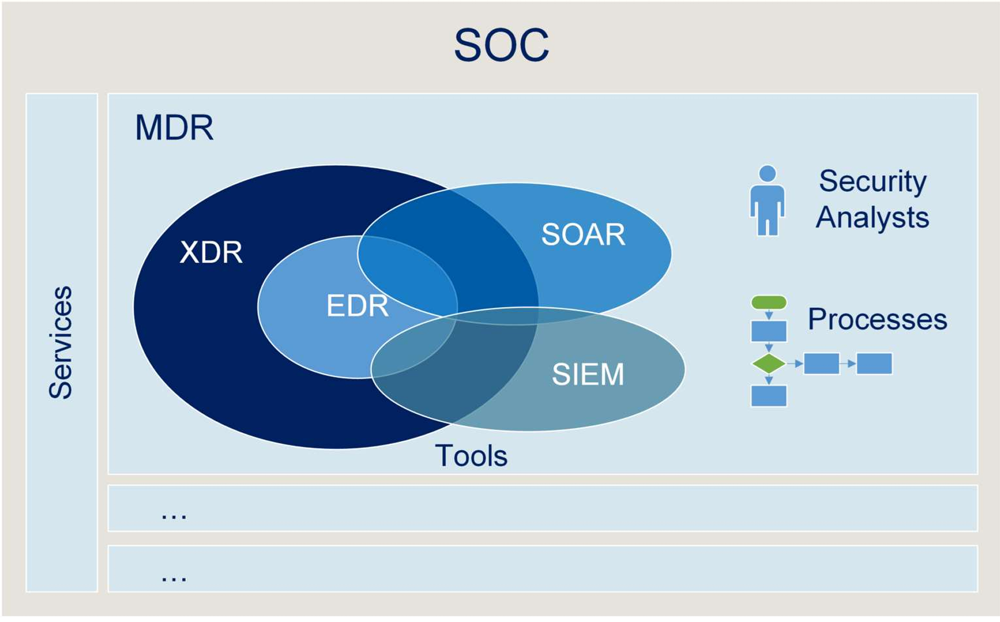
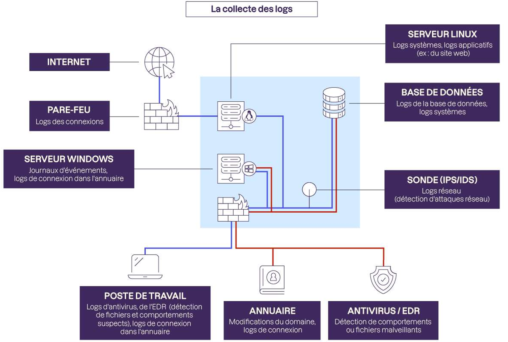
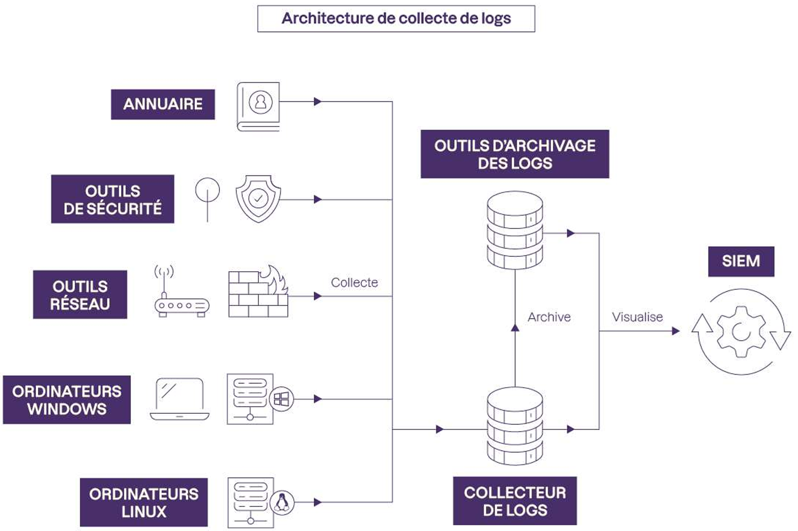
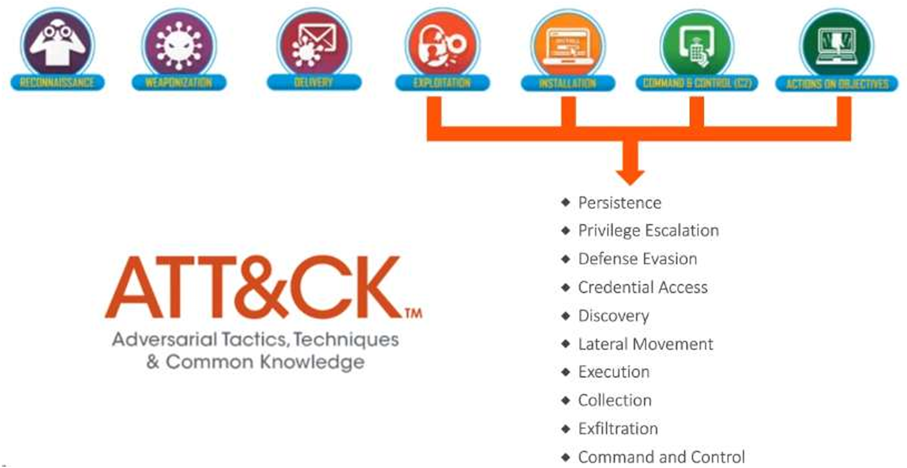
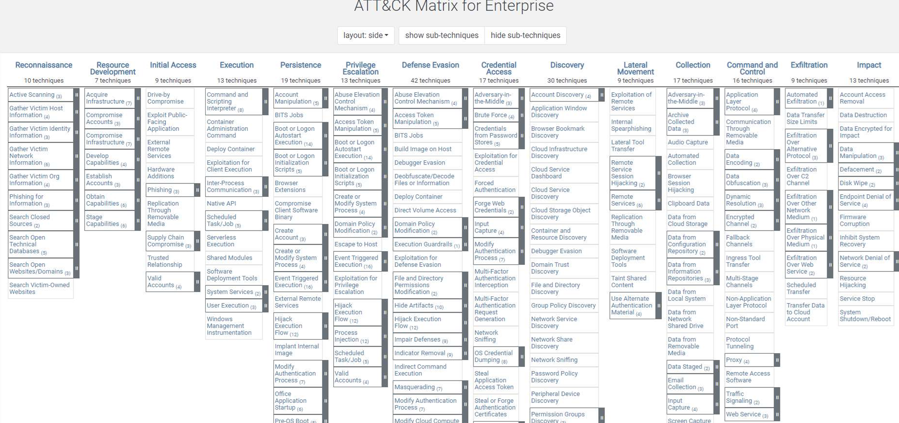
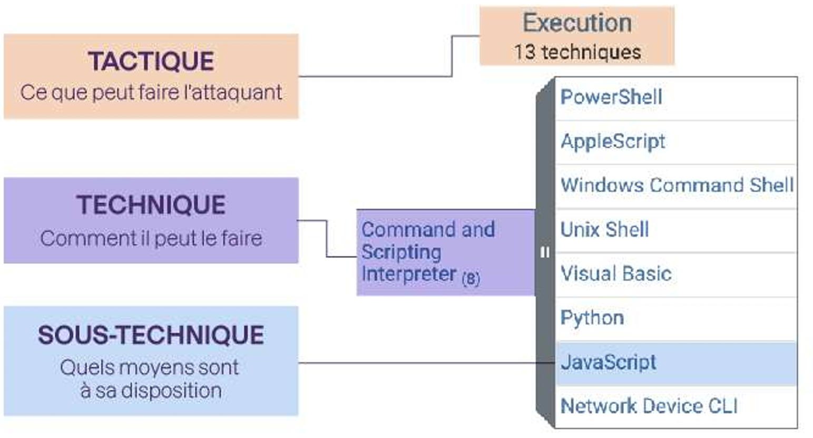
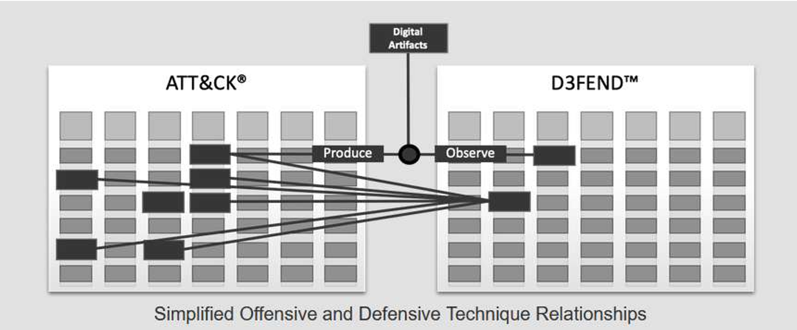

# :satellite: Solutions de sécurité & WAZUH

!!! abstract "Fiche module"
    **Source** : Hacoeurethique — Module 1-2  
    **Public** : Terminale NSI — Orientation métiers de la cybersécurité  
    **Objectif** : Comprendre les solutions de sécurité (SIEM, EDR, Anti-Virus) à travers l'application de techniques de furtivité

---

## :dart: 1. Pourquoi identifier et corriger les vulnérabilités ?

L'identification et la correction des vulnérabilités jouent un **rôle crucial** dans le renforcement de la sécurité des systèmes d'information.

!!! success "Les 7 bénéfices clés"
    - :shield: **Prévention des failles** : combler les vulnérabilités *avant* qu'elles ne soient exploitées réduit considérablement les risques d'incidents
    - :no_entry: **Réduction des attaques réussies** : les attaquants ciblent les systèmes vulnérables — corriger, c'est diminuer la probabilité de succès
    - :locked: **Protection des données sensibles** : une vulnérabilité non corrigée peut exposer des données à des vols ou compromissions
    - :white_check_mark: **Maintien de la disponibilité** : les vulnérabilités peuvent être exploitées pour perturber les services ou provoquer des pannes
    - :scroll: **Conformité réglementaire** : de nombreuses normes exigent l'identification et la correction des vulnérabilités. S'équiper d'un EDR, SIEM et/ou XDR y contribue fortement
    - :moneybag: **Économies à long terme** : corriger tôt coûte moins cher que gérer une violation majeure
    - :brain: **Adaptation aux nouvelles menaces** : les menaces évoluent, de nouvelles vulnérabilités apparaissent en permanence

---

## :building_construction: 2. Vue d'ensemble des solutions de sécurité

### 2.1 SOC vs SIEM — quelle différence ?

!!! info "SOC — Security Operation Center"
    Le SOC est le **centre des opérations de sécurité**. Il se concentre sur la surveillance des menaces et la qualification des incidents. Les **analystes** du SOC utilisent des outils de détection (SIEM, EDR, XDR) pour générer des **alertes de sécurité**.

!!! info "SIEM — Security Information and Event Management"
    Le SIEM est l'outil historiquement utilisé par les SOC pour surveiller les infrastructures et les SI dans leur ensemble. Techniquement, c'est un outil qui **collecte des données** (les logs), les **normalise**, les **agrège** puis les **corrèle** pour générer des alertes de sécurité ou créer des tableaux de bord de conformité.

### 2.2 Les solutions de détection et réponse

=== ":computer: EDR — Endpoint Detection and Response"

    Les logiciels EDR surveillent les **terminaux** (ordinateurs, serveurs, tablettes, téléphones) et non le réseau du SI.
    
    Ils analysent les usages via l'**analyse comportementale** : reconnaissance de comportements déviant d'une norme, après une phase d'apprentissage. Les EDR sont aussi capables de surveiller l'exploitation de failles.
    
    :point_right: *Avantage : protège à la fois contre les attaques **connues** (virus) et **inconnues** (comportements suspects).*

=== ":globe_with_meridians: NDR — Network Detection and Response"

    Le NDR apporte une **visibilité à l'échelle du réseau** pour détecter des attaquants possiblement cachés, ciblant les infrastructures physiques, virtuelles et cloud.
    
    Il offre une vue d'ensemble sur les interactions entre les **nœuds du réseau**, révélant toute l'étendue d'une attaque.
    
    !!! warning "Attention"
        Il est **indispensable** d'avoir un EDR et/ou un SIEM **avant** d'acquérir un NDR. Le NDR seul n'apporte pas assez de contexte pour traiter les alertes.

=== ":zap: XDR — Extended Detection and Response"

    Les solutions XDR permettent de **démocratiser** les outils de détection. En SaaS, elles regroupent des données provenant de **différentes sources** du SI et les relient entre elles.
    
    Le XDR ne surveille pas seulement les Endpoints, mais aussi les **emails, serveurs et le Cloud**.
    
    En augmentant les capacités de détection, le XDR permet une **réaction rapide** aux menaces, **en amont de la kill chain**, limitant nettement les dégâts.

=== ":handshake: MDR — Managed Detection and Response"

    Le MDR regroupe les solutions **managées** (gérées par un fournisseur de cybersécurité) et le service de détection/réponse aux incidents. Les solutions sont opérées par un SOC, interne ou externalisé.
    
    Grâce à l'automatisation via un outil d'orchestration (**SOAR** — Security Orchestration Automation and Response), un analyste peut procéder à une **remédiation automatique** lorsqu'une menace est détectée et confirmée.

### 2.3 Tableau récapitulatif

| Acronyme | Nom complet | Rôle principal |
|:--------:|-------------|----------------|
| **SOC** | Security Operation Center | Centre de surveillance et qualification des incidents |
| **SIEM** | Security Information and Event Management | Collecte, corrélation et alertes sur les logs |
| **EDR** | Endpoint Detection and Response | Surveillance et remédiation sur les terminaux |
| **NDR** | Network Detection and Response | Visibilité réseau, détection d'attaquants cachés |
| **XDR** | Extended Detection and Response | Détection étendue (endpoints + emails + cloud) |
| **MDR** | Managed Detection and Response | Solutions managées avec remédiation automatisée |
| **SOAR** | Security Orchestration Automation and Response | Orchestration et automatisation des réponses |

!!! tip "En résumé :triangular_ruler:"
    - **EDR** : précision et remédiation sur les postes de travail et serveurs
    - **NDR** : couverture réseau, mais ne surveille pas les endpoints
    - **XDR** : abolit les frontières de détection, apporte l'automatisation pour détecter les attaques sophistiquées




### 2.4 Le CSIRT

!!! info "CSIRT — Computer Security Incident Response Team"
    Entité qui gère l'**investigation et la réponse aux incidents critiques** dans le cadre d'une crise cyber. Les équipes du CSIRT travaillent en anticipation : elles enrichissent les outils de connaissance de la menace (*Threat Intelligence*) et interviennent en urgence pour accompagner les entreprises dans la gestion de crises.

!!! question "Quelle(s) solution(s) choisir ?"
    Selon **GARTNER**, pour atteindre une visibilité complète sur les menaces, un SIEM seul ne suffit pas. La crise sanitaire et la généralisation du télétravail ont montré qu'il est crucial de **sécuriser les endpoints**. Il est conseillé de fonctionner par **combinaisons** de solutions.

---

## :mag: 3. Fonctionnement du SIEM

Le SIEM est un outil puissant de gestion centralisée des journaux, d'analyse des événements de sécurité, de corrélation des informations et de génération d'alertes.

### 3.1 Les fonctionnalités principales

=== ":inbox_tray: Collecte des journaux"

    - **Sources multiples** : systèmes d'exploitation, applications, pare-feux, routeurs, commutateurs, etc.
    - **Temps réel** : collecte en temps réel pour une détection proactive

=== ":brain: Analyse des événements"

    - **Normalisation** : conversion des journaux bruts en format standardisé
    - **Analyse comportementale** : surveillance des modèles de comportement pour détecter les activités suspectes

=== ":link: Corrélation"

    - **Corrélation automatique** : identification de relations entre événements pour détecter des incidents complexes
    - **Corrélation temporelle** : analyse du timing pour détecter des attaques coordonnées

=== ":bell: Génération d'alertes"

    - **Temps réel** : alertes immédiates lors d'événements de sécurité critiques
    - **Hiérarchisation** : attribution de niveaux de gravité pour prioriser les réponses

=== ":file_cabinet: Stockage et investigation"

    - **Stockage centralisé** avec chiffrement pour la confidentialité
    - **Recherche avancée** et filtrage par critères spécifiques
    - **Corrélation historique** pour une compréhension approfondie des incidents

=== ":bar_chart: Tableaux de bord et conformité"

    - **Dashboards personnalisés** pour visualiser tendances et performances
    - **Rapports préconfigurés** pour la communication avec les parties prenantes
    - **Audit automatique** et rapports de conformité réglementaire

### 3.2 Sources de logs collectés

??? example "Exemples de logs collectés par un SIEM"
    | Source | Type de logs |
    |--------|-------------|
    | Postes de travail | Logs antivirus, EDR, fichiers suspects, connexion |
    | Serveurs Linux | Logs système, logs applicatifs (site web) |
    | Serveurs Windows | Journaux d'événements, connexion à l'annuaire |
    | Pare-feux | Logs des connexions |
    | Bases de données | Logs de la BDD, logs système |
    | Sondes IPS/IDS | Logs réseau, détection d'attaques |
    | Proxy web | Logs de navigation |
    | Switches Wi-Fi | Logs de connexions sans fil |
    | Cloud | Logs système, applications métiers et bureautiques |
    | Serveur mail | Logs de messagerie |
    | Annuaire (AD) | Modifications du domaine, logs de connexion |





---

## :shield: 4. Fonctionnement d'un EDR/XDR

### 4.1 Surveillance des activités

!!! info "Ce que surveille un EDR"
    - **Événements système** : fichiers modifiés, processus en cours, connexions réseau
    - **Analyse comportementale** : modélisation du comportement normal, détection d'anomalies
    - **Surveillance continue** en temps réel
    - **Capture forensique** : capture de la mémoire des terminaux pour analyse post-incident

### 4.2 Détection des menaces

| Type de détection | Méthode |
|-------------------|---------|
| **Menaces connues** | Base de signatures, comparaison avec des schémas connus |
| **Menaces inconnues** | Analyse comportementale avancée (pas de signature nécessaire) |
| **Attaques sophistiquées** | Corrélation des Indicateurs de Compromission (IOC) |
| **APT** | Surveillance des techniques avancées (mouvement latéral, rétro-ingénierie) |

### 4.3 Réponse aux menaces

!!! danger "Capacités de réponse d'un EDR :zap:"
    - :no_entry: **Isolation réseau** : isoler un terminal compromis pour éviter la propagation
    - :wastebasket: **Éradication automatisée** : éliminer automatiquement les malwares détectés
    - :robot: **Réponse automatisée** : blocage des attaques en temps réel
    - :clipboard: **Workflows d'incidents** : gestion coordonnée des incidents
    - :detective: **Enquête forensique** : analyse post-incident pour comprendre l'étendue de l'attaque

### 4.4 Fonctionnalités avancées

- :closed_lock_with_key: **Chiffrement des communications** entre terminaux et serveur EDR
- :brain: **Intelligence artificielle et Machine Learning** pour l'analyse prédictive des comportements malveillants
- :jigsaw: **Interopérabilité** avec d'autres solutions de sécurité

---

## :world_map: 5. MITRE ATT&CK — Portail de renseignement sur les menaces

!!! tip "À la portée de tous :open_book:"
    Entièrement **libre d'accès**, MITRE ATT&CK est un point de départ pour structurer une démarche de *Threat Intelligence* : capitalisation, analyse et compréhension des modes opératoires attaquants, mais aussi détection et évaluation de ses propres défenses.

    :link: [https://attack.mitre.org/](https://attack.mitre.org/)

### 5.1 Les TTP — Tactiques, Techniques et Procédures

MITRE ATT&CK est d'abord un **wiki**, une base de données considérable remplie de fiches sur les acteurs, les campagnes, les logiciels malveillants et leurs **tactiques, techniques et procédures (TTPs)**.



??? abstract "Les 13 tactiques MITRE ATT&CK"
    Chaque « tactique » est un **objectif** que l'attaquant cherche à atteindre dans le SI compromis :

    | # | Tactique | Description |
    |:-:|---------|-------------|
    | 1 | **Reconnaissance** | Collecte d'informations sur la cible |
    | 2 | **Développement de ressource** | Préparation de l'infrastructure d'attaque |
    | 3 | **Accès initial** | Première pénétration dans le SI |
    | 4 | **Exécution** | Lancement de code malveillant |
    | 5 | **Persistance** | Maintien de l'accès dans le temps |
    | 6 | **Escalade de privilèges** | Obtention de droits supérieurs |
    | 7 | **Évasion des défenses** | Contournement des protections |
    | 8 | **Vol d'identifiants** | Récupération de credentials |
    | 9 | **Exploration (Discovery)** | Cartographie du SI infiltré |
    | 10 | **Mouvements latéraux** | Déplacement vers d'autres machines |
    | 11 | **Collection de données** | Rassemblement des données ciblées |
    | 12 | **Exfiltration** | Extraction des données vers l'extérieur |
    | 13 | **C2 (Command & Control)** | Communication avec l'infrastructure de l'attaquant |

    Pour atteindre ces objectifs, l'attaquant met en œuvre une ou plusieurs **techniques**. Ce sont ces techniques qui sont cartographiées dans la matrice.



### 5.2 La structure Tactique → Technique → Sous-technique

!!! example "Exemple : la tactique « Exécution »"
    | Niveau | Signification | Exemple |
    |--------|--------------|---------|
    | **Tactique** | Ce que peut faire l'attaquant | Exécution (13 techniques) |
    | **Technique** | Comment il peut le faire | Command and Scripting Interpreter |
    | **Sous-technique** | Quels moyens à sa disposition | PowerShell, Unix Shell, Python, JavaScript... |



### 5.3 Le Navigator

Le **Navigator** est un outil interactif permettant de naviguer dans les tactiques et techniques, de mettre en surbrillance certaines d'entre elles pour modéliser un mode opératoire, et de comparer des « layers » (couches) entre elles.

:link: [https://attack.mitre.org/resources/working-with-attack/](https://attack.mitre.org/resources/working-with-attack/)

!!! tip "Compatibilité avec la Cyber Kill Chain"
    MITRE ATT&CK est totalement **compatible avec la Cyber Kill Chain** et peut être utilisé en complément des étapes d'installation, d'exploitation ou d'actions sur objectifs.

### 5.4 MITRE D3FEND — La matrice inversée

!!! success "D3FEND : le pendant défensif d'ATT&CK :shield:"
    **D3FEND** est un schéma complémentaire à ATT&CK dont l'ambition est d'établir un **langage commun** pour les cyberdéfenseurs.

    Alors qu'ATT&CK classifie les outils et méthodes des **attaquants**, D3FEND est un graphe de connaissances qui liste toutes les **actions possibles pour les équipes de sécurité** :

    - :map: **Cartographier** ce qui est exposé et à protéger
    - :bricks: **Durcir** les systèmes pour compliquer la vie des attaquants
    - :scissors: **Isoler** les systèmes pour empêcher les mouvements latéraux
    - :performing_arts: **Tromper** les attaquants avec de faux actifs (honeypots)
    - :no_entry: **Chasser** les attaquants en bloquant les actifs compromis

    :point_right: À partir d'une technique ATT&CK, on identifie les actions D3FEND, et inversement !

    :link: [https://d3fend.mitre.org/](https://d3fend.mitre.org/)



---

## :blue_heart: 6. WAZUH — SIEM + XDR Open Source

*Section rédigée à partir de la documentation officielle publique de Wazuh ([wazuh.com](https://wazuh.com/), [documentation.wazuh.com](https://documentation.wazuh.com/), [github.com/wazuh](https://github.com/wazuh/wazuh)) et de sources ouvertes.*

### 6.1 Définition

!!! info "Wazuh, c'est quoi ?"
    Wazuh se définit comme la **plateforme de cybersécurité open source la plus largement adoptée**, unifiant **XDR** et **SIEM** dans une solution unique. Elle analyse les données de sécurité à travers les endpoints, les clouds et les réseaux pour détecter les menaces, répondre aux incidents et assurer la conformité.

    :point_right: *Wazuh est utilisé par plus de 100 000 organisations dans le monde (dont la NASA, Salesforce, eBay) pour protéger plus de 15 millions d'endpoints.*

    :link: [Site officiel](https://wazuh.com/) — [Documentation](https://documentation.wazuh.com/) — [GitHub](https://github.com/wazuh/wazuh)

Wazuh est né en 2015 comme un fork d'**OSSEC**, avec l'ambition de moderniser et d'étendre les capacités de cette solution historique de détection d'intrusion.

### 6.2 Architecture

Wazuh combine les capacités d'un **SIEM** (collecte, normalisation, corrélation de logs, alertes) et d'un **XDR** (détection étendue sur endpoints, cloud, réseau + réponse automatisée).

L'architecture se compose de quatre briques principales :

| Composant | Rôle |
|-----------|------|
| **Wazuh Agent** | Installé sur chaque endpoint (serveurs, VM, conteneurs), collecte les données de sécurité : logs, intégrité des fichiers, inventaire logiciel. Supporte aussi le mode *agentless* via Syslog, SSH ou API |
| **Wazuh Server** | Gère les agents, analyse les données reçues à travers des **decoders** et des **rules**, utilise la *threat intelligence* pour chercher des indicateurs de compromission (IOC) |
| **Wazuh Indexer** | Basé sur **OpenSearch**, indexe et stocke les alertes. Permet la recherche rapide, le filtrage et l'analyse sur de grands volumes. **Filebeat** assure le transfert sécurisé des données du serveur vers l'indexer |
| **Wazuh Dashboard** | Interface web pour visualiser les alertes, gérer les agents et interagir avec la plateforme. Communique avec le serveur via API REST |

!!! tip "Systèmes supportés (source : GitHub Wazuh)"
    **Agents** : Windows, Linux, macOS, HP-UX, Solaris, AIX  
    **Sans agent** : firewalls, switches, routeurs, IDS réseau — via Syslog et configuration par API ou SSH  
    **Déploiement** : single-node ou multi-node, on-premise, cloud, ou conteneurs (Docker, Kubernetes, Ansible, Puppet)

### 6.3 Flux de données

Le traitement des données dans Wazuh suit un pipeline en deux étapes :

```
Sources (Serveurs, Postes, Cloud, Réseau)
        │
        ▼
┌─────────────────────────────┐
│      Wazuh Server           │
│  ┌───────────────────────┐  │
│  │   Analysis Engine     │  │
│  │  (Decoders → Rules)   │  │
│  └───────┬───────────────┘  │
│    Match ─┤── No match      │
│          ▼                  │
│   alerts.json               │
│   (rule level, severity,    │
│    MITRE mapping, details)  │
└──────────┬──────────────────┘
           │ Filebeat
           ▼
┌─────────────────────┐    ┌──────────────────────┐
│   Wazuh Indexer     │───▶│   Wazuh Dashboard    │
│   (OpenSearch)      │    │   (OpenSearch)        │
│   Alerts Indices    │    │   Visualisation       │
│   Archives Indices  │    │   Investigation       │
└─────────────────────┘    └──────────────────────┘
```

1. **Decoders** : décomposent les logs bruts en paires clé-valeur structurées
2. **Rules** : appliquent les règles de détection, corrèlent les événements, assignent un niveau de sévérité et un mapping MITRE ATT&CK

### 6.4 Fonctionnalités

??? abstract "Les capacités de Wazuh — cliquer pour développer"
    | Fonction | Description | Documentation |
    |----------|-------------|:------------:|
    | :inbox_tray: **Collecte et corrélation de logs** | Collecte les logs systèmes et applicatifs, les normalise et les corrèle pour générer des alertes | [Log data collection](https://documentation.wazuh.com/current/user-manual/capabilities/log-data-collection/index.html) |
    | :file_folder: **FIM** (File Integrity Monitoring) | Surveille le système de fichiers en temps réel : changements de contenu, permissions, propriété. Identifie les utilisateurs et applications responsables | [FIM](https://documentation.wazuh.com/current/user-manual/capabilities/file-integrity/index.html) |
    | :mag: **Détection de vulnérabilités** | Les agents collectent l'inventaire logiciel, corrélé avec les bases CVE (NVD, Microsoft, Canonical) pour identifier les logiciels vulnérables | [Vulnerability detection](https://documentation.wazuh.com/current/user-manual/capabilities/vulnerability-detection/index.html) |
    | :gear: **SCA** (Security Configuration Assessment) | Vérifie que les systèmes sont conformes aux politiques de sécurité et aux benchmarks CIS. Identifie les mauvaises configurations pour **réduire la surface d'attaque** | [SCA](https://documentation.wazuh.com/current/user-manual/capabilities/sec-config-assessment/index.html) |
    | :microbe: **Détection de malwares et rootkits** | Recherche les fichiers cachés, processus masqués, listeners réseau non enregistrés, anomalies dans les appels système | [Malware detection](https://documentation.wazuh.com/current/user-manual/capabilities/malware-detection/index.html) |
    | :bell: **Détection d'intrusions en temps réel** | Analyse basée sur des règles et sur le comportement pour détecter les menaces connues et inconnues | [Threat detection](https://documentation.wazuh.com/current/user-manual/capabilities/threat-detection/index.html) |
    | :zap: **Réponse active automatisée** | Exécute des contre-mesures automatiques : blocage d'accès, quarantaine, exécution de commandes à distance sur les agents | [Active response](https://documentation.wazuh.com/current/user-manual/capabilities/active-response/index.html) |
    | :cloud: **Sécurité cloud et conteneurs** | Surveillance des environnements AWS, Google Cloud, Azure, Docker, Kubernetes | [Cloud security](https://documentation.wazuh.com/current/cloud-security/index.html) |
    | :world_map: **MITRE ATT&CK** | Mapping des alertes sur les tactiques et techniques adverses pour une meilleure compréhension des menaces | [MITRE ATT&CK](https://documentation.wazuh.com/current/user-manual/ruleset/mitre.html) |
    | :scroll: **Conformité réglementaire** | Contrôles intégrés pour PCI DSS, NIST 800-53, GDPR, HIPAA, TSC. Rapports et dashboards de conformité automatisés | [Regulatory compliance](https://documentation.wazuh.com/current/compliance/index.html) |

### 6.5 Intégrations et écosystème

Wazuh s'intègre avec de nombreux outils tiers, documentés publiquement :

=== ":shield: Threat Intelligence"

    - **MITRE ATT&CK** : mapping natif de toutes les alertes sur les tactiques et techniques
    - **VirusTotal** : vérification des fichiers via API (plus de 70 moteurs antivirus)
    - **YARA** : règles de détection de malwares personnalisées
    
    :link: [VirusTotal integration](https://documentation.wazuh.com/current/user-manual/capabilities/malware-detection/virus-total-integration.html)

=== ":cloud: Cloud & SaaS"

    - **Amazon AWS** : collecte des logs CloudTrail, VPC Flow Logs, GuardDuty
    - **Google Cloud Platform** : logs d'audit GCP
    - **Microsoft Office 365** : logs d'audit SharePoint, Exchange, Azure AD, Teams
    - **GitHub** : monitoring des logs d'audit des organisations
    - **Docker** : surveillance de l'activité des conteneurs
    
    :link: [Cloud security monitoring](https://documentation.wazuh.com/current/cloud-security/index.html)

=== ":jigsaw: Orchestration & outils tiers"

    - **TheHive** : gestion de cas et réponse aux incidents
    - **Shuffle** (SOAR) : automatisation des workflows de réponse
    - **PagerDuty** : notification et gestion d'astreinte
    - **Slack** : alertes en temps réel
    - Compatibilité avec **Elasticsearch / OpenSearch** et **Kibana / OpenSearch Dashboards**
    
    :link: [Third-party integrations](https://documentation.wazuh.com/current/user-manual/manager/manual-integration.html)

### 6.6 Exemple de scénario : détection et réponse automatique

La documentation officielle de Wazuh décrit plusieurs cas d'usage reproductibles. Voici un scénario type :

??? danger "Scénario : Brute force SSH avec blocage automatique"
    **Situation** : un attaquant tente de forcer l'accès SSH à un serveur Linux surveillé par un agent Wazuh.

    **Ce que fait Wazuh** :

    1. L'agent collecte les logs `/var/log/auth.log` en temps réel
    2. Le moteur d'analyse détecte les échecs d'authentification répétés (règles `5710`, `5712`)
    3. Après un seuil configurable d'échecs, une alerte de niveau 10+ est générée : *"Multiple authentication failures"*
    4. Si un accès réussi suit les échecs, une alerte spécifique est déclenchée : *"Multiple authentication failures followed by a success"* (règle `40112`, niveau 12)
    5. L'**Active Response** est déclenchée : l'IP de l'attaquant est automatiquement bloquée via `firewall-drop` pour une durée configurable
    6. Les alertes sont mappées sur MITRE ATT&CK : **T1110 – Brute Force** (tactique : Credential Access)

    :link: [Blocking SSH brute force attacks](https://documentation.wazuh.com/current/proof-of-concept-guide/block-malicious-actor-ip-reputation.html)

??? danger "Scénario : Détection d'attaque web (Shellshock)"
    **Situation** : un attaquant exploite la vulnérabilité Shellshock (CVE-2014-6271) sur un serveur web Apache.

    **Ce que fait Wazuh** :

    1. L'agent surveille les logs Apache (`/var/log/apache2/access.log`)
    2. Le moteur d'analyse détecte le pattern Shellshock dans le User-Agent HTTP
    3. Une alerte de **niveau 15** (maximum) est générée : *"Shellshock attack detected"*
    4. Mapping MITRE : **T1190 – Exploit Public-Facing Application** + **T1068 – Exploitation for Privilege Escalation**
    5. L'Active Response bloque l'IP source automatiquement

    :link: [Detecting web attacks](https://documentation.wazuh.com/current/proof-of-concept-guide/detect-web-attack-sql-injection.html)

### 6.7 Avantages de Wazuh

!!! success "Pourquoi Wazuh est un bon choix pour découvrir la cyberdéfense ? :rocket:"
    - :free: **Open Source et gratuit** — pas de coût de licence, pas de limitation d'agents ou d'utilisateurs
    - :earth_africa: Adopté par **plus de 100 000 organisations** dans le monde depuis 2015
    - :people_holding_hands: **Large communauté active** : Slack, GitHub, Reddit, Discord, Google Groups
    - :package: **Tout-en-un** : SIEM + XDR + FIM + scanner de vulnérabilités + conformité dans une seule plateforme
    - :wrench: **Personnalisable** : règles, decoders, active responses modifiables et extensibles
    - :world_map: **MITRE ATT&CK natif** : chaque alerte est mappée sur les tactiques et techniques adverses
    - :scroll: **Conformité intégrée** : PCI DSS, NIST 800-53, GDPR, HIPAA, TSC, CIS Benchmarks
    - :cloud: **Multi-environnement** : on-premise, cloud (AWS, GCP, Azure), conteneurs (Docker, Kubernetes)
    - :art: **Dashboard intuitif** basé sur OpenSearch avec visualisations personnalisables

### 6.8 Comparatif avec les solutions propriétaires

| Critère | Elastic Security | **Wazuh** | Microsoft Sentinel |
|---------|:----------------:|:---------:|:------------------:|
| **Technologie** | Open Source | Open Source (basé sur Elastic/OpenSearch) | Propriétaire |
| **Déploiement** | Self-hosted / Cloud | Self-hosted / Cloud | Cloud natif (Azure) |
| **Coût de licence** | Abonnement (tiers payants) | **Gratuit** | Pay-As-You-Go |
| **SIEM** | Oui | **Oui** | Oui |
| **XDR / EDR** | Oui | **Oui** | M365 Defender |
| **Gestion des vulnérabilités** | Tiers nécessaire | **Natif** | Defender VM |
| **FIM + SCA natifs** | Modules séparés | **Natif et intégré** | Modules séparés |
| **MITRE ATT&CK** | Oui | **Oui (natif)** | Oui |
| **Conformité** | Partielle | **PCI DSS, NIST, GDPR, HIPAA, TSC** | Partielle |

*Sources : [wazuh.com](https://wazuh.com/), [Devoteam](https://www.devoteam.com/expert-view/enhancing-cybersecurity-with-wazuh-the-open-source-xdr-siem-platform/), [Sirius Open Source](https://www.siriusopensource.com/en-us/blog/wazuh-versus-proprietary-xdr-and-siem-platforms-honest-comparison)*

---

## :link: 7. Ressources Wazuh (sources publiques)

!!! info "Liens utiles :bookmark:"
    | Ressource | Lien |
    |-----------|------|
    | :blue_heart: **Site officiel Wazuh** | [https://wazuh.com/](https://wazuh.com/) |
    | :books: **Documentation complète** | [https://documentation.wazuh.com/](https://documentation.wazuh.com/) |
    | :test_tube: **Proof of Concept guides** | [https://documentation.wazuh.com/current/proof-of-concept-guide/](https://documentation.wazuh.com/current/proof-of-concept-guide/) |
    | :newspaper: **Blog Wazuh** (cas d'usage) | [https://wazuh.com/blog/](https://wazuh.com/blog/) |
    | :computer: **GitHub** | [https://github.com/wazuh/wazuh](https://github.com/wazuh/wazuh) |
    | :cloud: **Wazuh Cloud (essai gratuit)** | [https://wazuh.com/cloud/](https://wazuh.com/cloud/) |
    | :mortar_board: **Installation quickstart** | [https://documentation.wazuh.com/current/quickstart.html](https://documentation.wazuh.com/current/quickstart.html) |
    | :world_map: **MITRE ATT&CK** | [https://attack.mitre.org/](https://attack.mitre.org/) |
    | :shield: **MITRE D3FEND** | [https://d3fend.mitre.org/](https://d3fend.mitre.org/) |

*Résumé de Hacoeurethique — Module Solutions de Sécurité & WAZUH*
